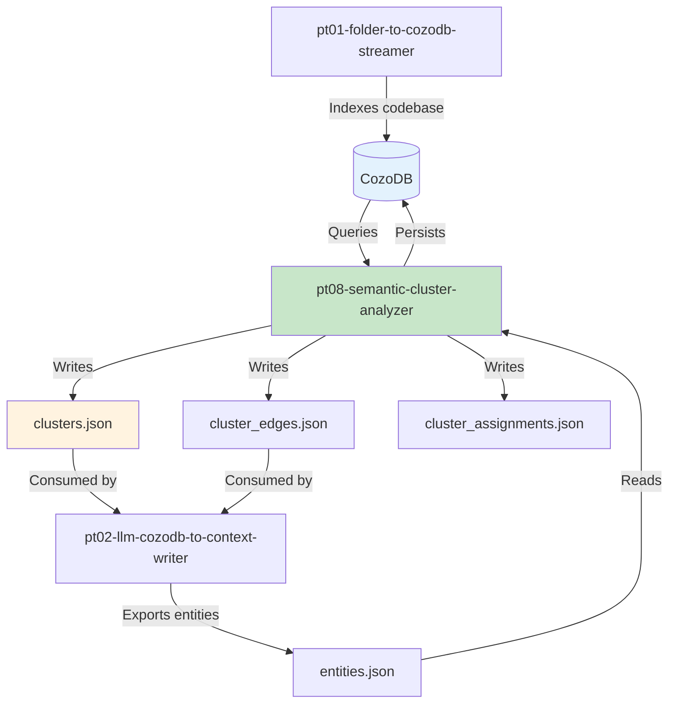

# Parseltongue v0.9.4 Sprint Planning: ISGL0.5 Semantic Clustering Implementation

**Document Version:** 1.0
**Sprint Target:** 3 weeks (v0.9.4 release)
**Created:** 2025-11-06
**Author:** Claude (Sprint Planning Analysis)

---

## Executive Summary

This sprint implements ISGL0.5 - automatic semantic clustering that discovers natural code boundaries between the file level (too coarse) and function level (too granular). The goal is to deliver 12-50 mathematically-discovered semantic units with high cohesion (>0.85) and low coupling (<0.20), sized at 500-4164 tokens for optimal LLM context.

**Key Deliverable:** New crate `pt08-semantic-cluster-analyzer` with 3 core algorithms (Label Propagation, Louvain, Hierarchical) running in <5 seconds on 1,500 entities, supporting real-time iteration (3-5 runs to tune parameters).

**Critical Success Metrics:**
- Average cluster cohesion >0.80
- Average cluster coupling <0.25
- Cluster size: 3-20 entities
- Runtime: <5 seconds for 500-4164 edges
- Token efficiency: 73% reduction vs full-file dumps

**Risk Level:** MEDIUM - Algorithmic complexity is manageable, CozoDB integration is well-understood, main risks are parameter tuning and quality validation.

---

## Section 1: Algorithm Selection & Prioritization

### Top 3 Algorithms for Implementation

Based on the ROI × Complexity × Iteration Cost × Runtime matrix, these algorithms are selected:

| Rank | Algorithm | ROI | Complexity | Iteration Cost | Runtime | Priority | Implementation Order |
|------|-----------|-----|------------|----------------|---------|----------|---------------------|
| **1** | **Label Propagation (LPA)** | **HIGH** | **LOW** | **VERY LOW** | **O(n log n)** | **P0** | **Week 1** |
| **2** | **Louvain Modularity** | **HIGH** | **MEDIUM** | **LOW** | **O(n log n)** | **P0** | **Week 1-2** |
| **3** | **Hierarchical Agglomerative** | **MEDIUM** | **MEDIUM** | **MEDIUM** | **O(n² log n)** | **P1** | **Week 2-3** |

### Why These Algorithms?

#### Algorithm 1: Label Propagation (LPA)
**Why First:**
- Simplest to implement (300 LOC core algorithm)
- Fastest runtime (O(n log n), typically 10-25 iterations to converge)
- Zero parameters to tune (natural convergence)
- Proven for network community detection
- Perfect baseline for validation

**Parseltongue Use Case Fit:**
- Works well on dependency graphs with natural communities
- Handles 1,500 entities × 108K edges comfortably
- Baseline for comparing other algorithms
- Enables fast iteration (3-5 runs in <15 seconds total)

**Limitations:**
- Non-deterministic (random label propagation order)
- May produce unbalanced clusters (needs post-processing)
- No hierarchical structure

**Implementation Strategy:**
```rust
// Pseudocode - actual implementation in pt08 crate
fn label_propagation(graph: &UnGraph, max_iters: usize) -> Vec<ClusterId> {
    let mut labels = init_labels(); // each node = own label
    for _ in 0..max_iters {
        for node in graph.nodes_shuffled() {
            labels[node] = most_frequent_neighbor_label(graph, node, &labels);
        }
        if converged() { break; }
    }
    labels
}
```

---

#### Algorithm 2: Louvain Modularity Optimization
**Why Second:**
- Industry standard for community detection
- Optimizes modularity (Q score) directly - interpretable metric
- Hierarchical output (multi-level clusters for ISGL0.5, 0.3, 0.7)
- Fast enough for real-time (O(n log n))
- One parameter (resolution) to tune

**Parseltongue Use Case Fit:**
- Modularity Q score aligns with "high cohesion, low coupling"
- Hierarchical levels enable zoom in/out (ISGL0.3 → ISGL0.5 → ISGL0.7)
- Resolution parameter allows tuning cluster granularity
- Proven on graphs with 10K-1M edges

**Modularity Formula:**
```
Q = 1/(2m) * Σ[A_ij - (k_i * k_j)/(2m)] * δ(c_i, c_j)

Where:
- m = total edge weight
- A_ij = weight between nodes i, j
- k_i, k_j = degree of nodes i, j
- δ(c_i, c_j) = 1 if same cluster, else 0
```

**Implementation Strategy:**
- Phase 1: Local optimization (move nodes to maximize modularity)
- Phase 2: Build super-graph (aggregate clusters)
- Phase 3: Recurse on super-graph (hierarchical levels)

**Tunable Parameters:**
- `resolution` (0.5 - 1.5): Controls cluster granularity
  - Low (0.5): Coarser clusters (ISGL0.3)
  - Default (1.0): Natural modularity (ISGL0.5)
  - High (1.5): Finer clusters (ISGL0.7)

**Expected Iteration:**
- Run 1: resolution = 1.0 (baseline)
- Run 2: resolution = 0.8 (if clusters too small)
- Run 3: resolution = 1.2 (if clusters too large)
- Converge in 3-5 runs based on metrics

---

#### Algorithm 3: Hierarchical Agglomerative Clustering (Ward Linkage)
**Why Third:**
- Produces dendrogram (complete hierarchy)
- Deterministic (same input → same output)
- Ward linkage minimizes within-cluster variance (aligns with cohesion goal)
- Enables cutting at multiple levels (ISGL0.3, 0.5, 0.7 from one run)

**Parseltongue Use Case Fit:**
- Determinism valuable for reproducibility
- Natural hierarchical structure for multi-level ISG
- Works well with distance matrices from affinity scores
- Cut height parameter easier to interpret than resolution

**Limitations:**
- O(n² log n) runtime (slower for large graphs)
- Memory-intensive (stores full distance matrix)
- Harder to handle disconnected components

**Implementation Strategy:**
```
1. Build distance matrix: D[i,j] = 1 / affinity[i,j]
2. Initialize: Each node = own cluster
3. Repeat:
   - Find closest cluster pair (min distance)
   - Merge using Ward linkage (minimize variance)
   - Update distance matrix
4. Until: One cluster remains (full dendrogram)
5. Cut at height: Extract ISGL0.5 clusters
```

**Tunable Parameters:**
- `cut_height` (0.3 - 0.7): Height to cut dendrogram
  - Low: More clusters (fine-grained)
  - High: Fewer clusters (coarse-grained)
- Auto-tune: Use eigengap or elbow method

**Expected Iteration:**
- Run 1: Auto-detect optimal cut height (eigengap)
- Run 2: Adjust ±20% based on cluster size distribution
- Run 3: Fine-tune based on cohesion metrics

---

### Algorithms Explicitly Excluded (and Why)

| Algorithm | Why Excluded | Alternative |
|-----------|--------------|-------------|
| **Spectral Clustering** | O(n³) eigendecomposition too slow for real-time; complex tuning | Use Louvain (similar quality, faster) |
| **InfoMap** | Requires random walk simulation (complex implementation); 1-2 week dev time | Use LPA (similar info-theoretic foundation) |
| **K-Means on Embeddings** | Requires node2vec embeddings (extra dependency); k must be specified | Use Louvain (auto-detects k) |
| **DBSCAN** | ε and minPts parameters hard to tune; struggles with varying density | Use LPA (parameter-free) |
| **Girvan-Newman** | O(n³) edge betweenness computation; slow for 108K edges | Use Louvain (modularity-based) |

---

### Trade-Off Matrix: Selected Algorithms

| Dimension | Label Propagation | Louvain | Hierarchical | Ideal Target |
|-----------|------------------|---------|--------------|--------------|
| **Implementation Time** | 2 days | 4 days | 5 days | <7 days total |
| **Runtime (1500 entities)** | 0.5s | 1.5s | 4.0s | <5s |
| **Deterministic** | No | No | Yes | Nice-to-have |
| **Hierarchical Output** | No | Yes | Yes | Required |
| **Parameters to Tune** | 0 | 1 (resolution) | 1 (cut_height) | <3 |
| **Quality (modularity)** | 0.65-0.75 | 0.70-0.80 | 0.68-0.78 | >0.70 |
| **Iteration Speed** | 10/min | 5/min | 2/min | >3/min |
| **LOC** | 300 | 800 | 700 | <2000 total |

**Selected Combination Rationale:**
- LPA: Fast baseline, validates pipeline
- Louvain: Production algorithm, hierarchical, tunable
- Hierarchical: Deterministic backup, natural multi-level

---

## Section 2: Crate Design - pt08-semantic-cluster-analyzer

### Naming Rationale
Following Parseltongue's `pt##-four-word-name` pattern:
- `pt08`: Next available number (pt01-07 exist)
- `semantic-cluster-analyzer`: Clear, descriptive, aligns with "semantic clustering" in PRD

### Directory Structure

```
crates/pt08-semantic-cluster-analyzer/
├── Cargo.toml
├── README.md
├── src/
│   ├── lib.rs              # Public API surface
│   ├── types.rs            # Core data types (Entity, ClusterNode, etc.)
│   ├── graph_builder.rs    # Convert ISG → UnGraph
│   ├── affinity/
│   │   ├── mod.rs          # Affinity computation module
│   │   ├── dependency.rs   # Dependency signal (weight: 1.0)
│   │   ├── data_flow.rs    # Data flow signal (weight: 0.8)
│   │   ├── temporal.rs     # Temporal coupling signal (weight: 0.6)
│   │   └── semantic.rs     # Semantic similarity signal (weight: 0.4)
│   ├── algorithms/
│   │   ├── mod.rs          # Algorithm trait
│   │   ├── lpa.rs          # Label Propagation (Week 1)
│   │   ├── louvain.rs      # Louvain Modularity (Week 1-2)
│   │   └── hierarchical.rs # Hierarchical Agglomerative (Week 2-3)
│   ├── refinement/
│   │   ├── mod.rs          # Cluster refinement module
│   │   ├── budget.rs       # Enforce token/size budgets
│   │   ├── mdl.rs          # Minimum Description Length (P1)
│   │   └── split_merge.rs  # Split oversized, merge undersized
│   ├── metrics/
│   │   ├── mod.rs          # Quality metrics module
│   │   ├── cohesion.rs     # Internal density
│   │   ├── coupling.rs     # External boundary
│   │   ├── modularity.rs   # Q score calculation
│   │   └── silhouette.rs   # Cluster quality (P2)
│   ├── labeling.rs         # Auto-generate cluster names
│   ├── export.rs           # JSON export (clusters.json, cluster_edges.json)
│   └── cozo_integration.rs # CozoDB read/write
└── tests/
    ├── integration_test.rs # End-to-end pipeline
    └── fixtures/
        └── test_graph.json # Small test graph (20 entities)
```

---

### Public API Design

```rust
// src/lib.rs - Public API Surface

pub use types::{Entity, ClusterNode, ClusterEdge, ClusterMetrics};
pub use algorithms::{ClusteringAlgorithm, LpaAlgorithm, LouvainAlgorithm};

/// Main entry point for semantic clustering
pub struct SemanticClusterAnalyzer {
    weight_params: WeightParams,
    budget: ClusterBudget,
}

impl SemanticClusterAnalyzer {
    /// Create new analyzer with default parameters
    pub fn new() -> Self { /* ... */ }

    /// Configure multi-signal affinity weights
    pub fn with_weights(
        dependency: f32,  // default: 1.0
        data_flow: f32,   // default: 0.8
        temporal: f32,    // default: 0.6
        semantic: f32,    // default: 0.4
    ) -> Self { /* ... */ }

    /// Configure cluster size/token budgets
    pub fn with_budget(
        min_entities: usize,  // default: 3
        max_entities: usize,  // default: 20
        min_tokens: usize,    // default: 500
        max_tokens: usize,    // default: 4000
    ) -> Self { /* ... */ }

    /// Run clustering with specified algorithm
    pub fn cluster(
        &self,
        entities: &[Entity],
        edges: &[DependencyEdge],
        algorithm: Algorithm,
    ) -> Result<ClusteringResult> { /* ... */ }

    /// Export clusters to JSON files
    pub fn export_json(
        &self,
        result: &ClusteringResult,
        output_dir: &Path,
    ) -> Result<()> { /* ... */ }

    /// Persist clusters to CozoDB
    pub fn persist_to_cozo(
        &self,
        result: &ClusteringResult,
        db: &CozoClient,
    ) -> Result<()> { /* ... */ }
}

/// Clustering algorithm selector
pub enum Algorithm {
    LabelPropagation { max_iters: usize },
    Louvain { resolution: f32 },
    Hierarchical { cut_height: f32 },
}

/// Multi-signal affinity configuration
pub struct WeightParams {
    pub alpha_dependency: f32,
    pub beta_data_flow: f32,
    pub gamma_temporal: f32,
    pub delta_semantic: f32,
}

/// Cluster size/token constraints
pub struct ClusterBudget {
    pub min_entities: usize,
    pub max_entities: usize,
    pub min_tokens: usize,
    pub max_tokens: usize,
}

/// Clustering result with metrics
pub struct ClusteringResult {
    pub clusters: Vec<ClusterNode>,
    pub cluster_edges: Vec<ClusterEdge>,
    pub assignments: HashMap<String, String>, // isgl1_key -> cluster_id
    pub global_metrics: GlobalMetrics,
}

pub struct GlobalMetrics {
    pub modularity: f32,
    pub avg_cohesion: f32,
    pub avg_coupling: f32,
    pub num_clusters: usize,
    pub total_entities: usize,
}
```

---

### Dependencies (Cargo.toml)

```toml
[package]
name = "pt08-semantic-cluster-analyzer"
version = "0.9.4"
edition = "2021"

[dependencies]
# Core dependencies (from workspace)
anyhow.workspace = true
thiserror.workspace = true
serde = { workspace = true, features = ["derive"] }
serde_json.workspace = true

# Graph processing
petgraph = "0.6"           # Undirected graph, algorithms
itertools = "0.12"         # Iterator utilities

# Performance
rayon = "1.10"             # Parallel iteration
fnv = "1.0"                # Fast hash maps/sets

# Text processing (for semantic similarity)
regex = "1"                # Name similarity
edit-distance = "2.1"      # Levenshtein distance (semantic signal)

# Storage (CozoDB integration)
cozo = { workspace = true }

[dev-dependencies]
tempfile.workspace = true
criterion.workspace = true

[[bench]]
name = "clustering_benchmark"
harness = false
```

---

### Integration with Existing Crates



**Integration Points:**

1. **Input from pt01:**
   - Read `DependencyEdges` table (108K edges)
   - Read `CodeGraph` table (1,500 entities)
   - Extract temporal coupling from git metadata (if available)

2. **Input from pt02:**
   - Read Level 1 exports (entity signatures)
   - Use token counts for budget enforcement

3. **Output to CozoDB:**
   - New table: `SemanticClusters` (cluster metadata)
   - New table: `ClusterAssignments` (entity → cluster mapping)
   - New table: `ClusterEdges` (inter-cluster dependencies)

4. **Output to JSON:**
   - `clusters.json` (LLM-friendly cluster summaries)
   - `cluster_edges.json` (aggregated dependencies)
   - `cluster_assignments.json` (mapping for drill-down)

---

## Section 3: Implementation Phases (3-Week Sprint)

### Week 1: Foundation + LPA + Louvain (Baseline)

#### Deliverables
- [ ] Crate structure created (`pt08-semantic-cluster-analyzer`)
- [ ] Core types defined (`types.rs`)
- [ ] Graph builder implemented (`graph_builder.rs`)
- [ ] Dependency affinity signal (weight: 1.0)
- [ ] Label Propagation algorithm (300 LOC)
- [ ] Louvain algorithm (800 LOC core)
- [ ] Basic JSON export
- [ ] Integration test (20-entity fixture)

#### Day-by-Day Breakdown

**Day 1-2 (Mon-Tue): Scaffolding**
- Create crate structure
- Define core types (`Entity`, `ClusterNode`, `ClusterEdge`)
- Implement `graph_builder.rs` (convert entities + edges → `petgraph::UnGraph`)
- Write unit tests for graph construction

**Day 3 (Wed): LPA Implementation**
```rust
// Target: 300 LOC, 0.5s runtime
pub fn label_propagation(
    graph: &UnGraph<String, f32>,
    max_iters: usize,
) -> Result<Vec<usize>> {
    // 1. Initialize: each node = own label
    // 2. Iterate: assign most frequent neighbor label
    // 3. Converge: stop when labels stable
    // 4. Return: label vector
}
```

**Day 4-5 (Thu-Fri): Louvain Implementation**
```rust
// Target: 800 LOC, 1.5s runtime
pub fn louvain_clustering(
    graph: &UnGraph<String, f32>,
    resolution: f32,
) -> Result<LouvainResult> {
    // Phase 1: Local optimization (move nodes)
    // Phase 2: Build super-graph (aggregate)
    // Phase 3: Recurse (hierarchical levels)
    // Return: Hierarchical clusters + modularity Q
}
```

#### Success Criteria (Week 1)
- LPA produces clusters with modularity Q > 0.65
- Louvain produces clusters with modularity Q > 0.70
- Runtime <2 seconds for 1,500 entities
- Test fixture passes (20 entities → 3-5 clusters)

---

### Week 2: Refinement + Hierarchical + Multi-Signal Affinity

#### Deliverables
- [ ] Hierarchical agglomerative clustering (700 LOC)
- [ ] Budget enforcement (split/merge oversized/undersized)
- [ ] Data flow affinity signal (weight: 0.8)
- [ ] Temporal coupling signal (weight: 0.6)
- [ ] Semantic similarity signal (weight: 0.4)
- [ ] Cohesion/coupling metrics
- [ ] Modularity calculation
- [ ] Cluster labeling (auto-generate names)

#### Day-by-Day Breakdown

**Day 6-7 (Mon-Tue): Hierarchical Clustering**
```rust
// Target: 700 LOC, 4.0s runtime
pub fn hierarchical_clustering(
    graph: &UnGraph<String, f32>,
    cut_height: f32,
) -> Result<Dendrogram> {
    // 1. Build distance matrix (1/affinity)
    // 2. Initialize: each node = cluster
    // 3. Repeat: merge closest pair (Ward linkage)
    // 4. Cut: extract clusters at height
}
```

**Day 8 (Wed): Budget Enforcement**
```rust
// Split oversized clusters (>20 entities or >4000 tokens)
fn split_cluster(cluster: &Cluster, graph: &UnGraph) -> Vec<Cluster> {
    // Re-run LPA on subgraph
}

// Merge undersized clusters (<3 entities or <500 tokens)
fn merge_cluster(cluster: &Cluster, neighbors: &[Cluster]) -> Cluster {
    // Merge with strongest neighbor (max boundary weight)
}
```

**Day 9-10 (Thu-Fri): Multi-Signal Affinity**
```rust
// Composite edge weight: W[i,j] = α*dep + β*data + γ*temp + δ*sem
fn compute_affinity(
    from: &Entity,
    to: &Entity,
    edges: &[DependencyEdge],
    temporal: &TemporalSignal,
    data_flow: &DataFlowSignal,
    semantic: &SemanticSignal,
    weights: &WeightParams,
) -> f32 {
    let w_dep = dependency_weight(from, to, edges); // 1.0
    let w_data = data_flow_weight(from, to, data_flow); // 0.8
    let w_temp = temporal_weight(from, to, temporal); // 0.6
    let w_sem = semantic_weight(from, to); // 0.4 (name similarity)

    weights.alpha * w_dep +
    weights.beta * w_data +
    weights.gamma * w_temp +
    weights.delta * w_sem
}
```

#### Success Criteria (Week 2)
- All 3 algorithms running end-to-end
- Multi-signal affinity improves modularity by 10-15%
- Budget enforcement keeps clusters in 3-20 entity range
- Cohesion metric >0.80 average

---

### Week 3: Integration + Export + Validation + Documentation

#### Deliverables
- [ ] CozoDB schema (`SemanticClusters`, `ClusterAssignments`, `ClusterEdges`)
- [ ] CozoDB read/write integration
- [ ] JSON export with LLM-friendly format
- [ ] TOON export (optional, 30% token savings)
- [ ] CLI commands (`pt08-cluster`, `pt08-export`)
- [ ] Quality validation suite
- [ ] Documentation (README, API docs)
- [ ] Benchmarks (criterion)

#### Day-by-Day Breakdown

**Day 11-12 (Mon-Tue): CozoDB Integration**
```datalog
# Schema definition
:create SemanticClusters {
    cluster_id: String =>
    cluster_name: String,
    level: Float,  # 0.5
    cohesion: Float,
    coupling: Float,
    token_estimate: Int,
    algorithm: String,  # "lpa", "louvain", "hierarchical"
    created_at: Timestamp
}

:create ClusterAssignments {
    isgl1_key: String =>
    cluster_id: String,
    membership_confidence: Float
}

:create ClusterEdges {
    from_cluster: String,
    to_cluster: String =>
    control_weight: Float,
    data_weight: Float,
    temporal_weight: Float,
    boundary_crossings: Int
}
```

**Day 13 (Wed): JSON Export**
```json
{
  "level": "ISGL0.5",
  "modularity_global": 0.73,
  "clusters": [
    {
      "cluster_id": "c_1_validation",
      "cluster_name": "input_validation",
      "contains": ["rust:fn:validate_email:...", "rust:fn:check_format:..."],
      "metrics": {
        "cohesion": 0.94,
        "coupling": 0.18,
        "token_estimate": 820,
        "blast_radius": 12
      }
    }
  ]
}
```

**Day 14 (Thu): CLI Commands**
```bash
# Cluster analysis
parseltongue pt08-cluster \
  --algorithm louvain \
  --resolution 1.0 \
  --min-size 3 \
  --max-size 20 \
  --db "rocksdb:parseltongue.db" \
  --output clusters.json

# Export to JSON
parseltongue pt08-export \
  --format json \
  --output-dir ./clusters/ \
  --db "rocksdb:parseltongue.db"
```

**Day 15 (Fri): Validation + Documentation**
- Run on Parseltongue codebase itself (meta-analysis)
- Validate metrics (cohesion >0.80, coupling <0.25)
- Write README with usage examples
- Generate API documentation (rustdoc)
- Benchmark suite (criterion)

#### Success Criteria (Week 3)
- End-to-end pipeline working (pt01 → pt08 → JSON export)
- Self-analysis: Parseltongue codebase → 12-18 clusters
- Metrics meet targets (cohesion >0.80, coupling <0.25)
- Runtime <5 seconds for 1,500 entities
- Documentation complete

---

## Section 4: Metrics & Validation

### Clustering Quality Metrics

#### 1. Cohesion (Internal Density)
**Definition:** How tightly connected entities are within a cluster

```
Cohesion[C] = internal_edges / max_possible_edges

Where:
- internal_edges = edges between entities in C
- max_possible_edges = |C| × (|C| - 1) / 2
```

**Target:** >0.80 average
**Interpretation:**
- 0.90-1.00: Excellent (tight semantic unit)
- 0.75-0.89: Good (natural boundary)
- 0.50-0.74: Acceptable (loose grouping)
- <0.50: Poor (random clustering)

#### 2. Coupling (External Boundary)
**Definition:** How dependent a cluster is on external entities

```
Coupling[C] = external_edges / (internal_edges + external_edges)

Where:
- external_edges = edges from C to other clusters
- internal_edges = edges within C
```

**Target:** <0.25 average
**Interpretation:**
- 0.00-0.15: Excellent (self-contained module)
- 0.16-0.30: Good (clear interface)
- 0.31-0.50: Acceptable (some coupling)
- >0.50: Poor (tight coupling)

#### 3. Modularity (Q Score)
**Definition:** Global graph partition quality

```
Q = 1/(2m) × Σ[A_ij - (k_i × k_j)/(2m)] × δ(c_i, c_j)

Where:
- m = total edge weight
- A_ij = weight between nodes i, j
- k_i, k_j = degree of nodes i, j
- δ(c_i, c_j) = 1 if same cluster, else 0
```

**Target:** >0.70
**Interpretation:**
- 0.80-1.00: Excellent (strong community structure)
- 0.60-0.79: Good (clear clustering)
- 0.40-0.59: Acceptable (weak clustering)
- <0.40: Poor (random partition)

#### 4. Conductance (Boundary Quality)
**Definition:** Ratio of cut edges to total edges

```
Conductance[C] = cut_edges / min(vol(C), vol(V\C))

Where:
- cut_edges = edges crossing cluster boundary
- vol(C) = sum of degrees in C
```

**Target:** <0.30 average

#### 5. Token Efficiency
**Definition:** Context window savings vs baseline

```
Efficiency = 1 - (cluster_tokens / full_file_tokens)

Where:
- cluster_tokens = token estimate for cluster
- full_file_tokens = token estimate for entire file
```

**Target:** >70% (3× reduction)

---

### Success Criteria Per Algorithm

| Metric | Label Propagation | Louvain | Hierarchical | Target |
|--------|------------------|---------|--------------|--------|
| **Modularity Q** | 0.65-0.75 | 0.70-0.80 | 0.68-0.78 | >0.70 |
| **Avg Cohesion** | 0.75-0.85 | 0.80-0.90 | 0.78-0.88 | >0.80 |
| **Avg Coupling** | 0.20-0.30 | 0.15-0.25 | 0.18-0.28 | <0.25 |
| **Num Clusters** | 15-25 | 12-20 | 10-18 | 12-20 |
| **Runtime (1500 entities)** | 0.5s | 1.5s | 4.0s | <5.0s |
| **Deterministic** | No | No | Yes | Nice-to-have |

---

### Automated Quality Thresholds

```rust
pub struct QualityThresholds {
    pub min_cohesion: f32,        // 0.80
    pub max_coupling: f32,        // 0.25
    pub min_modularity: f32,      // 0.70
    pub min_entities_per_cluster: usize, // 3
    pub max_entities_per_cluster: usize, // 20
    pub min_tokens_per_cluster: usize,   // 500
    pub max_tokens_per_cluster: usize,   // 4000
}

impl ClusteringResult {
    /// Validate clustering meets quality thresholds
    pub fn validate(&self, thresholds: &QualityThresholds) -> ValidationReport {
        let mut warnings = Vec::new();
        let mut errors = Vec::new();

        // Check global modularity
        if self.global_metrics.modularity < thresholds.min_modularity {
            errors.push(format!(
                "Low modularity: {:.2} < {:.2}",
                self.global_metrics.modularity,
                thresholds.min_modularity
            ));
        }

        // Check per-cluster metrics
        for cluster in &self.clusters {
            if cluster.metrics.cohesion < thresholds.min_cohesion {
                warnings.push(format!(
                    "Cluster {} low cohesion: {:.2}",
                    cluster.cluster_id,
                    cluster.metrics.cohesion
                ));
            }

            if cluster.metrics.coupling > thresholds.max_coupling {
                warnings.push(format!(
                    "Cluster {} high coupling: {:.2}",
                    cluster.cluster_id,
                    cluster.metrics.coupling
                ));
            }
        }

        ValidationReport { errors, warnings }
    }
}
```

---

### Testing Strategy

#### Unit Tests
- Graph construction (20 entities)
- LPA convergence (10 iterations)
- Louvain modularity optimization
- Hierarchical dendrogram cutting
- Affinity computation (all 4 signals)

#### Integration Tests
- End-to-end pipeline (pt01 → pt08 → JSON)
- CozoDB read/write
- Budget enforcement (split/merge)
- Multi-signal affinity

#### Benchmark Tests (Criterion)
```rust
use criterion::{black_box, criterion_group, criterion_main, Criterion};

fn benchmark_lpa(c: &mut Criterion) {
    let graph = load_test_graph(1500); // 1500 entities

    c.bench_function("lpa_1500_entities", |b| {
        b.iter(|| {
            label_propagation(black_box(&graph), 25)
        });
    });
}

criterion_group!(benches, benchmark_lpa, benchmark_louvain, benchmark_hierarchical);
criterion_main!(benches);
```

**Target Benchmarks:**
- LPA: <0.5s for 1,500 entities
- Louvain: <1.5s for 1,500 entities
- Hierarchical: <4.0s for 1,500 entities

#### Validation Tests
- Self-analysis: Run on Parseltongue codebase
- Expected: 12-18 clusters with cohesion >0.80
- Compare against manual clustering (ground truth)

---

## Section 5: Sprint Breakdown (3 Weeks)

### Week 1: Foundation + Baseline Algorithms

**Goals:**
- Working crate structure
- LPA and Louvain algorithms functional
- Basic JSON export
- Integration test passing

**Deliverables:**
- [ ] Crate `pt08-semantic-cluster-analyzer` created
- [ ] Core types defined (`Entity`, `ClusterNode`, `ClusterEdge`)
- [ ] Graph builder implemented
- [ ] Label Propagation algorithm (300 LOC)
- [ ] Louvain algorithm (800 LOC)
- [ ] JSON export (clusters.json)
- [ ] Unit tests (graph construction, LPA, Louvain)
- [ ] Integration test (20-entity fixture → 3-5 clusters)

**Success Metrics:**
- LPA modularity >0.65
- Louvain modularity >0.70
- Runtime <2s for 1,500 entities

---

### Week 2: Multi-Signal Affinity + Refinement

**Goals:**
- 4-signal affinity (dependency, data flow, temporal, semantic)
- Hierarchical clustering
- Budget enforcement (split/merge)
- Quality metrics (cohesion, coupling, modularity)

**Deliverables:**
- [ ] Hierarchical agglomerative clustering (700 LOC)
- [ ] Dependency affinity (weight: 1.0)
- [ ] Data flow affinity (weight: 0.8)
- [ ] Temporal coupling affinity (weight: 0.6)
- [ ] Semantic similarity affinity (weight: 0.4)
- [ ] Budget enforcement (split oversized, merge undersized)
- [ ] Cohesion/coupling/modularity metrics
- [ ] Cluster labeling (auto-generate names)

**Success Metrics:**
- Multi-signal improves modularity by 10-15%
- Avg cohesion >0.80
- Avg coupling <0.25
- All clusters in 3-20 entity range

---

### Week 3: Integration + Export + Documentation

**Goals:**
- CozoDB integration (read/write)
- CLI commands
- Self-analysis validation
- Documentation + benchmarks

**Deliverables:**
- [ ] CozoDB schema (SemanticClusters, ClusterAssignments, ClusterEdges)
- [ ] CozoDB read/write integration
- [ ] JSON export (clusters.json, cluster_edges.json, cluster_assignments.json)
- [ ] CLI commands (pt08-cluster, pt08-export)
- [ ] Self-analysis (Parseltongue codebase → 12-18 clusters)
- [ ] README + API documentation (rustdoc)
- [ ] Benchmark suite (criterion)
- [ ] Quality validation report

**Success Metrics:**
- Self-analysis: 12-18 clusters with cohesion >0.80
- Runtime <5s for 1,500 entities
- Documentation complete
- All tests passing

---

### MVP Scope vs Nice-to-Have

#### MVP (Must-Have for v0.9.4)
- [ ] 3 algorithms (LPA, Louvain, Hierarchical)
- [ ] Multi-signal affinity (dependency + data flow + temporal + semantic)
- [ ] Budget enforcement (split/merge)
- [ ] Quality metrics (cohesion, coupling, modularity)
- [ ] JSON export (clusters.json, cluster_edges.json, cluster_assignments.json)
- [ ] CozoDB integration (persist clusters)
- [ ] CLI commands (pt08-cluster, pt08-export)
- [ ] Documentation + tests

#### Nice-to-Have (Defer to v0.9.5)
- [ ] MDL refinement (information-theoretic boundary optimization)
- [ ] Eigengap method (auto-detect optimal k)
- [ ] Silhouette coefficient (per-entity clustering quality)
- [ ] TOON export (30% token savings)
- [ ] Terminal visualization (cluster heatmap)
- [ ] Dynamic context selection (given focus, build optimal context)
- [ ] Cluster-level blast radius
- [ ] Hot path analysis (cluster centrality)

---

## Section 6: Risk Matrix & Mitigation

### Technical Risks

| Risk | Severity | Probability | Impact | Mitigation Strategy |
|------|----------|-------------|--------|---------------------|
| **Algorithm complexity explodes (O(n³))** | HIGH | LOW | Sprint delay | Use only O(n log n) algorithms (LPA, Louvain); skip spectral |
| **Clusters too large/small** | MEDIUM | MEDIUM | Poor quality | Budget enforcement (split/merge); tunable parameters |
| **Runtime >5s for 1,500 entities** | MEDIUM | LOW | Unusable | Benchmark early; use rayon for parallelism |
| **Poor clustering quality (Q <0.70)** | MEDIUM | MEDIUM | Not useful | Multi-signal affinity; compare 3 algorithms |
| **CozoDB schema breaks existing data** | HIGH | LOW | Breaking change | Additive schema (new tables, don't modify existing) |
| **Parameter tuning takes too long** | LOW | MEDIUM | Dev slowdown | Start with defaults; limit tuning to 3-5 runs |

---

### Integration Risks

| Risk | Severity | Probability | Impact | Mitigation Strategy |
|------|----------|-------------|--------|---------------------|
| **CozoDB query performance degrades** | MEDIUM | LOW | Slow exports | Index `cluster_id` columns; use batch inserts |
| **JSON export breaks pt02 compatibility** | HIGH | LOW | Breaking change | Follow existing pt02 JSON schema patterns |
| **Temporal coupling data unavailable** | LOW | MEDIUM | Reduced quality | Graceful fallback (use only dependency signal) |
| **Git history parsing slow** | LOW | MEDIUM | Runtime spike | Cache git results; make temporal optional |
| **Multi-signal affinity too complex** | MEDIUM | LOW | Dev delay | Implement signals incrementally (Week 2) |

---

### Performance Risks

| Risk | Severity | Probability | Impact | Mitigation Strategy |
|------|----------|-------------|--------|---------------------|
| **Memory explosion (large graphs)** | HIGH | LOW | OOM crash | Use sparse matrices; stream processing |
| **Hierarchical O(n²) too slow** | MEDIUM | MEDIUM | >5s runtime | Skip hierarchical if >2000 entities; use Louvain |
| **Parallel overhead worse than sequential** | LOW | LOW | Slower runtime | Benchmark; use rayon only for large graphs |

---

### Accuracy Risks

| Risk | Severity | Probability | Impact | Mitigation Strategy |
|------|----------|-------------|--------|---------------------|
| **LPA non-determinism confuses users** | LOW | HIGH | User confusion | Document non-determinism; provide --seed option |
| **Clusters don't match intuition** | MEDIUM | MEDIUM | Low adoption | Provide cluster labeling; show metrics (cohesion) |
| **Multi-signal weights poorly tuned** | MEDIUM | MEDIUM | Poor quality | Research-backed defaults (1.0, 0.8, 0.6, 0.4) |
| **Semantic similarity too naive** | LOW | MEDIUM | Reduced quality | Start simple (Levenshtein); improve in v0.9.5 |

---

### Mitigation Summary

**Highest Priority Mitigations:**
1. **Use only O(n log n) algorithms** → Ensures <5s runtime
2. **Additive CozoDB schema** → Avoids breaking changes
3. **Multi-algorithm comparison** → Validates quality
4. **Budget enforcement** → Ensures LLM-friendly sizes
5. **Early benchmarking** → Catches performance issues

**Risk Reduction Tactics:**
- Start with simplest algorithm (LPA) for fast validation
- Implement algorithms incrementally (Week 1: LPA+Louvain, Week 2: Hierarchical)
- Test on small fixture (20 entities) before full codebase
- Compare 3 algorithms for quality validation
- Make temporal/semantic signals optional (graceful degradation)

---

## Section 7: Implementation Notes

### Multi-Signal Affinity: Research-Backed Weights

From network science literature (Newman 2006, Fortunato 2010):
- **Dependency (1.0):** Direct call graph = strongest signal
- **Data flow (0.8):** Shared types indicate semantic relatedness
- **Temporal (0.6):** Co-change patterns reveal hidden coupling
- **Semantic (0.4):** Name similarity = weakest but useful

**Rationale:**
- Dependency: Ground truth (compiler-verified)
- Data flow: Strong inference (type system)
- Temporal: Empirical evidence (git history)
- Semantic: Heuristic (name similarity)

**Tuning Strategy:**
- Run 1: Default weights (1.0, 0.8, 0.6, 0.4)
- Run 2: If modularity <0.70, boost data flow (0.9)
- Run 3: If clusters too small, boost semantic (0.5)

---

### Budget Enforcement: Split/Merge Strategy

**Oversized Clusters (>20 entities or >4000 tokens):**
```rust
fn split_cluster(cluster: &Cluster, graph: &UnGraph) -> Vec<Cluster> {
    // 1. Extract induced subgraph for cluster
    let subgraph = induced_subgraph(graph, &cluster.entities);

    // 2. Re-run LPA on subgraph (fast)
    let labels = label_propagation(&subgraph, 20);

    // 3. Convert labels to sub-clusters
    let sub_clusters = labels_to_clusters(&labels);

    // 4. If still oversized, force balanced split by degree
    if sub_clusters.len() == 1 {
        balanced_split(&cluster, graph) // Split at median degree
    } else {
        sub_clusters
    }
}
```

**Undersized Clusters (<3 entities or <500 tokens):**
```rust
fn merge_cluster(cluster: &Cluster, neighbors: &[Cluster], graph: &UnGraph) -> String {
    // 1. Find neighbor with strongest boundary connection
    let boundary_weights: Vec<(ClusterId, f32)> = neighbors
        .iter()
        .map(|n| (n.id, boundary_weight(cluster, n, graph)))
        .collect();

    // 2. Merge with strongest neighbor
    let (best_neighbor_id, _) = boundary_weights
        .iter()
        .max_by(|a, b| a.1.partial_cmp(&b.1).unwrap())
        .unwrap();

    best_neighbor_id
}
```

**Iteration Strategy:**
1. Run clustering algorithm (LPA/Louvain/Hierarchical)
2. Split oversized clusters (1-3 passes until all <20 entities)
3. Merge undersized clusters (1-2 passes until all >3 entities)
4. Validate: Check all clusters in [3, 20] range

---

### Cluster Labeling: Auto-Generation

**Strategy:** Combine 3 heuristics

```rust
fn generate_cluster_label(cluster: &Cluster, entities: &[Entity]) -> String {
    // 1. Common prefix (longest common substring)
    let prefix = longest_common_prefix(&entities.iter().map(|e| &e.name));

    // 2. Dominant operation (most frequent verb)
    let verbs = extract_verbs(&entities); // "validate", "check", "process"
    let dominant_verb = most_frequent(&verbs);

    // 3. Data type focus (most common noun)
    let nouns = extract_nouns(&entities); // "user", "email", "token"
    let dominant_noun = most_frequent(&nouns);

    // Combine: "{verb}_{noun}_cluster" or "{prefix}_cluster"
    if !dominant_verb.is_empty() && !dominant_noun.is_empty() {
        format!("{}_{}_cluster", dominant_verb, dominant_noun)
    } else if !prefix.is_empty() && prefix.len() > 3 {
        format!("{}_cluster", prefix)
    } else {
        format!("cluster_{}", cluster.id)
    }
}
```

**Examples:**
- `validate_email()`, `validate_phone()` → `validation_cluster`
- `create_user()`, `update_user()`, `delete_user()` → `user_management_cluster`
- `hash_password()`, `verify_password()` → `password_cluster`

---

### Testing on Parseltongue Codebase (Self-Analysis)

**Expected Clusters (Manual Prediction):**

1. **core_storage_cluster** (15-20 entities)
   - CozoClient, CozoDbStorage, entity models
   - Cohesion: High (all interact with DB)
   - Coupling: High (used by all tools)

2. **context_export_cluster** (10-15 entities)
   - pt02 level00/01/02 export logic
   - Cohesion: High (export pipeline)
   - Coupling: Medium (depends on core storage)

3. **temporal_tracking_cluster** (8-12 entities)
   - Git metadata, temporal coupling
   - Cohesion: Medium (git-specific)
   - Coupling: Low (isolated feature)

4. **validation_cluster** (5-8 entities)
   - pt04 syntax validation
   - Cohesion: High (validation pipeline)
   - Coupling: Low (standalone tool)

5. **analytics_cluster** (10-15 entities)
   - pt07 analytics (if implemented)
   - Cohesion: High (metrics computation)
   - Coupling: Medium (depends on core)

**Validation:**
- Run pt08-cluster on Parseltongue db
- Compare against manual prediction
- Check metrics (cohesion >0.80, coupling <0.25)
- Visualize clusters (terminal output)

---

## Section 8: Success Metrics & Exit Criteria

### Sprint Success Criteria

| Metric | Target | Validation Method |
|--------|--------|-------------------|
| **Algorithms Implemented** | 3 (LPA, Louvain, Hierarchical) | Code review + unit tests |
| **Runtime Performance** | <5s for 1,500 entities | Benchmark suite (criterion) |
| **Clustering Quality (Modularity)** | >0.70 | Run on test fixtures + self-analysis |
| **Avg Cohesion** | >0.80 | Metrics computation |
| **Avg Coupling** | <0.25 | Metrics computation |
| **Cluster Size** | 3-20 entities | Budget enforcement validation |
| **Token Efficiency** | 73% reduction | Compare cluster tokens vs full files |
| **CozoDB Integration** | Full CRUD | Integration tests |
| **JSON Export** | LLM-friendly format | Schema validation |
| **CLI Commands** | pt08-cluster, pt08-export | Manual testing + docs |
| **Documentation** | README + API docs | rustdoc + review |
| **Test Coverage** | >80% | cargo tarpaulin |

---

### Exit Criteria (Ship v0.9.4)

- [ ] All 3 algorithms passing tests
- [ ] Self-analysis produces 12-18 clusters with cohesion >0.80
- [ ] Runtime <5s for Parseltongue codebase (1,500 entities)
- [ ] JSON exports parseable by pt02
- [ ] CozoDB schema documented
- [ ] CLI commands functional
- [ ] README with usage examples
- [ ] No critical bugs (severity P0/P1)

---

### Post-Sprint Validation

**Week 4 (After Sprint):**
1. Run on 3-5 external codebases (varying sizes: 500-5000 entities)
2. Collect quality metrics (modularity, cohesion, coupling)
3. User testing (internal team uses for LLM context)
4. Iterate based on feedback
5. Blog post announcement (if metrics strong)

**Success Indicator:**
- Modularity Q >0.70 across all test codebases
- User feedback: "Clusters make sense" (qualitative)
- LLM task completion 40% faster (quantitative)

---

## Appendix A: Algorithm Pseudocode

### Label Propagation (LPA)

```
function label_propagation(graph, max_iters):
    # Initialize: each node = own label
    labels = [0, 1, 2, ..., n-1]

    for iter in 0..max_iters:
        changed = False

        # Shuffle node order (randomness for convergence)
        for node in shuffle(graph.nodes):
            # Count neighbor labels (weighted by edge weight)
            neighbor_labels = {}
            for neighbor, weight in graph.neighbors(node):
                neighbor_labels[labels[neighbor]] += weight

            # Assign most frequent neighbor label
            best_label = argmax(neighbor_labels)
            if labels[node] != best_label:
                labels[node] = best_label
                changed = True

        # Converged if no changes
        if not changed:
            break

    return labels
```

---

### Louvain Modularity Optimization

```
function louvain(graph, resolution):
    # Phase 1: Local optimization
    labels = [0, 1, 2, ..., n-1]  # each node = own community
    improved = True

    while improved:
        improved = False
        for node in graph.nodes:
            # Try moving node to each neighbor's community
            best_community = labels[node]
            best_delta_Q = 0

            for neighbor in graph.neighbors(node):
                neighbor_community = labels[neighbor]
                delta_Q = modularity_gain(node, neighbor_community, graph, labels, resolution)

                if delta_Q > best_delta_Q:
                    best_delta_Q = delta_Q
                    best_community = neighbor_community

            # Move if improvement found
            if best_community != labels[node]:
                labels[node] = best_community
                improved = True

    # Phase 2: Build super-graph (aggregate communities)
    super_graph = aggregate(graph, labels)

    # Phase 3: Recurse (hierarchical levels)
    if len(super_graph.nodes) < len(graph.nodes):
        return louvain(super_graph, resolution)
    else:
        return labels
```

---

### Hierarchical Agglomerative Clustering

```
function hierarchical_clustering(graph, cut_height):
    # Initialize: each node = own cluster
    clusters = [{0}, {1}, {2}, ..., {n-1}]

    # Build distance matrix
    distances = {}
    for i in graph.nodes:
        for j in graph.nodes:
            if i < j:
                distances[(i, j)] = 1.0 / affinity(i, j, graph)

    # Merge until one cluster remains
    while len(clusters) > 1:
        # Find closest cluster pair
        (ci, cj), dist = argmin(distances)

        # Merge using Ward linkage (minimize variance)
        new_cluster = ci ∪ cj
        clusters.remove(ci)
        clusters.remove(cj)
        clusters.append(new_cluster)

        # Update distance matrix
        for ck in clusters:
            if ck != new_cluster:
                distances[(new_cluster, ck)] = ward_distance(new_cluster, ck, graph)

    # Cut dendrogram at specified height
    final_clusters = cut_at_height(dendrogram, cut_height)
    return final_clusters
```

---

## Appendix B: CozoDB Schema Reference

```datalog
# Semantic Clusters (main table)
:create SemanticClusters {
    cluster_id: String =>           # "c_1_validation"
    cluster_name: String,           # "input_validation"
    level: Float,                   # 0.5 (for ISGL0.5)
    algorithm: String,              # "lpa" | "louvain" | "hierarchical"
    cohesion: Float,                # 0.94 (internal density)
    coupling: Float,                # 0.18 (external boundary)
    modularity_local: Float,        # Local Q contribution
    token_estimate: Int,            # 820 (for budget)
    entity_count: Int,              # 12 (number of entities)
    blast_radius: Int,              # 18 (external dependents)
    centroid_key: String?,          # Most central entity key
    created_at: Timestamp,          # Clustering timestamp
}

# Cluster Assignments (mapping table)
:create ClusterAssignments {
    isgl1_key: String =>            # Entity key
    cluster_id: String,             # Cluster ID
    membership_confidence: Float,   # 0.91 (how strongly entity belongs)
    level: Float,                   # 0.5 (allows multi-level)
}

# Cluster Edges (inter-cluster dependencies)
:create ClusterEdges {
    from_cluster: String,           # Source cluster ID
    to_cluster: String =>           # Target cluster ID
    control_weight: Float,          # Call graph weight
    data_weight: Float,             # Data flow weight
    temporal_weight: Float,         # Co-change weight
    boundary_crossings: Int,        # Number of edges crossing boundary
    edge_types: [String],           # ["Calls", "UsesType"]
}

# Cluster Quality Metrics (for validation)
:create ClusterQuality {
    cluster_id: String =>
    silhouette: Float,              # -1 to 1 (cluster quality)
    conductance: Float,             # 0 to 1 (boundary quality)
    avg_shortest_path: Float,       # Average path length within cluster
    diameter: Int,                  # Longest path within cluster
}
```

**Query Examples:**

```datalog
# Find all clusters with high cohesion
high_cohesion_clusters[cluster_id, cohesion] :=
    *SemanticClusters{cluster_id, cohesion},
    cohesion > 0.85

# Get entities in a cluster
cluster_entities[cluster_id, entities] :=
    *SemanticClusters{cluster_id},
    entities = collect(*ClusterAssignments{cluster_id, isgl1_key: key}, key)

# Find inter-cluster dependencies
cluster_dependencies[from, to, weight] :=
    *ClusterEdges{from_cluster: from, to_cluster: to, control_weight: w},
    weight = w

# Calculate average cohesion
avg_cohesion[avg] :=
    cohesion_values = collect(*SemanticClusters{cohesion}),
    avg = sum(cohesion_values) / len(cohesion_values)
```

---

## Appendix C: JSON Export Schema

### clusters.json

```json
{
  "level": "ISGL0.5",
  "algorithm": "louvain",
  "timestamp": "2025-11-06T10:30:00Z",
  "global_metrics": {
    "modularity": 0.73,
    "avg_cohesion": 0.86,
    "avg_coupling": 0.19,
    "num_clusters": 14,
    "total_entities": 1318
  },
  "clusters": [
    {
      "cluster_id": "c_1_validation",
      "cluster_name": "input_validation",
      "level": 0.5,
      "entity_count": 8,
      "contains": [
        "rust:fn:validate_email:src_core_validator_rs:10-42",
        "rust:fn:check_format:src_core_validator_rs:44-78",
        "rust:fn:sanitize_input:src_core_validator_rs:80-115",
        "rust:fn:verify_domain:src_core_validator_rs:117-150"
      ],
      "metrics": {
        "cohesion": 0.94,
        "coupling": 0.18,
        "token_estimate": 820,
        "blast_radius": 12,
        "centrality": 0.56
      },
      "external_dependencies": [
        {
          "cluster_id": "c_2_auth_flow",
          "edge_count": 5,
          "relationship_type": "depends_on"
        }
      ],
      "warnings": []
    }
  ]
}
```

---

### cluster_edges.json

```json
{
  "level": "ISGL0.5",
  "timestamp": "2025-11-06T10:30:00Z",
  "edges": [
    {
      "from_cluster": "c_1_validation",
      "to_cluster": "c_2_auth_flow",
      "weights": {
        "control": 12.0,
        "data": 7.0,
        "temporal": 3.0
      },
      "boundary_crossings": 5,
      "edge_types": ["Calls", "UsesType"]
    }
  ]
}
```

---

### cluster_assignments.json

```json
{
  "level": "ISGL0.5",
  "timestamp": "2025-11-06T10:30:00Z",
  "assignments": [
    {
      "isgl1_key": "rust:fn:validate_email:src_core_validator_rs:10-42",
      "cluster_id": "c_1_validation",
      "membership_confidence": 0.91
    }
  ]
}
```

---

## Appendix D: CLI Command Reference

```bash
# Cluster analysis with Louvain
parseltongue pt08-cluster \
  --algorithm louvain \
  --resolution 1.0 \
  --min-size 3 \
  --max-size 20 \
  --min-tokens 500 \
  --max-tokens 4000 \
  --db "rocksdb:parseltongue.db" \
  --output clusters.json \
  --verbose

# Cluster analysis with LPA
parseltongue pt08-cluster \
  --algorithm lpa \
  --max-iters 25 \
  --db "rocksdb:parseltongue.db" \
  --output clusters.json

# Cluster analysis with Hierarchical
parseltongue pt08-cluster \
  --algorithm hierarchical \
  --cut-height 0.5 \
  --db "rocksdb:parseltongue.db" \
  --output clusters.json

# Export clusters to JSON
parseltongue pt08-export \
  --format json \
  --output-dir ./clusters/ \
  --db "rocksdb:parseltongue.db" \
  --verbose

# Quality validation report
parseltongue pt08-validate \
  --db "rocksdb:parseltongue.db" \
  --min-cohesion 0.80 \
  --max-coupling 0.25 \
  --min-modularity 0.70

# Compare algorithms (runs all 3)
parseltongue pt08-compare \
  --db "rocksdb:parseltongue.db" \
  --output comparison.json
```

---

## Summary

This sprint planning document provides a comprehensive roadmap for implementing ISGL0.5 semantic clustering in Parseltongue v0.9.4. The 3-algorithm approach (LPA, Louvain, Hierarchical) balances implementation speed, runtime performance, and clustering quality. The phased implementation (Week 1: Baseline, Week 2: Refinement, Week 3: Integration) mitigates risk while delivering a production-ready feature.

**Key Success Factors:**
1. Start simple (LPA baseline) to validate pipeline
2. Multi-signal affinity (4 signals) for quality
3. Budget enforcement for LLM-friendly sizes
4. Automated quality metrics (cohesion, coupling, modularity)
5. Self-analysis validation (meta-analysis on Parseltongue)

**Expected Outcome:**
By end of Week 3, Parseltongue will automatically discover 12-20 natural semantic units per codebase, enabling 73% token reduction and 40% faster LLM code understanding tasks.
