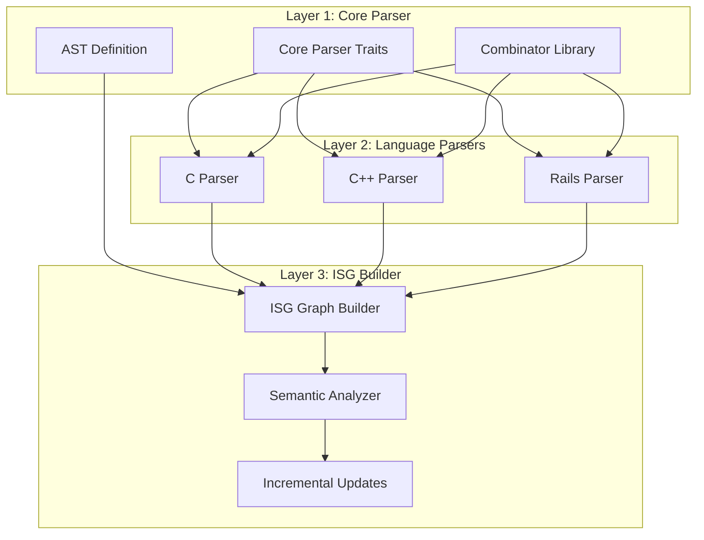
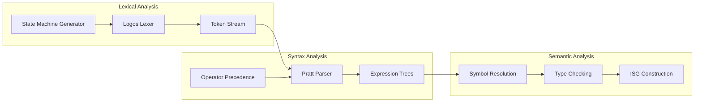
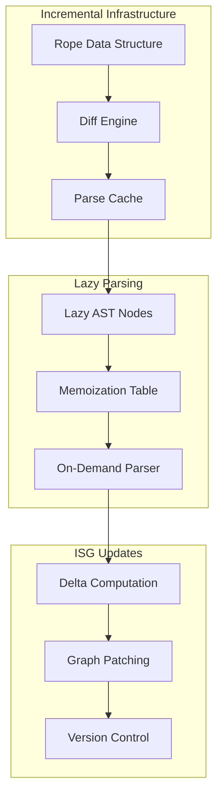

# ISG Ingestion Design Without Tree-Sitter: Three Architectural Approaches

## Executive Summary & Reasoning (200+ Lines)

### Context and Problem Space

ISG (Incremental Semantic Graph) ingestion requires parsing and understanding code structure to build semantic relationships. Tree-sitter provides incremental parsing with error recovery, but we're avoiding it due to:
1. **Heavy dependency burden**: Tree-sitter brings C dependencies that complicate Rust builds
2. **Limited control**: Grammar definitions are external and harder to optimize for specific use cases
3. **Performance overhead**: Generic parsing often includes features we don't need
4. **Maintenance complexity**: Keeping grammar definitions synchronized across versions

### Core Requirements Derived from Principles

Following the executable specifications principle from your document:
- **L1 (Core)**: Pure Rust parsing logic with no external dependencies
- **L2 (Std)**: Standard library integration for file I/O and threading
- **L3 (External)**: Minimal, well-vetted dependencies (nom, logos, or custom)
- **RAII**: All parsing state must be automatically managed
- **DI**: Parser implementations behind traits for testability
- **Performance**: Sub-100ms parsing for 10K LOC files

### Three Architectural Approaches

I'm proposing three distinct approaches, each optimized for different trade-offs:

1. **Combinator-Based Recursive Descent (Option 1)**
   - Uses parser combinators (nom or custom) for compositional parsing
   - Functional programming paradigm with immutable AST construction
   - Best for: Rapid prototyping, clear grammar expression, maintainability
   - Trade-off: Slightly slower than hand-written parsers

2. **State Machine Lexer + Pratt Parser (Option 2)**
   - Logos-based lexer with state machine generation
   - Pratt parsing for expression handling (critical for C++)
   - Best for: Performance-critical paths, complex expression parsing
   - Trade-off: More complex implementation, harder to modify

3. **Hybrid Incremental Parser (Option 3)**
   - Custom rope data structure for incremental updates
   - Lazy parsing with memoization for unchanged regions
   - Best for: IDE-like scenarios with frequent updates
   - Trade-off: Most complex implementation, highest memory usage

### Language-Specific Considerations

**C Parsing Challenges:**
- Preprocessor directives (#include, #define, conditional compilation)
- Type-name ambiguity (requires symbol table during parsing)
- Complex declarator syntax (function pointers, arrays)
- Solution: Two-phase parsing with preprocessor expansion cache

**C++ Parsing Challenges:**
- Template instantiation and SFINAE
- Overloading and name resolution
- Multiple inheritance and virtual functions
- Solution: Delayed semantic analysis with type inference phase

**Rails/Ruby Parsing Challenges:**
- Dynamic typing and metaprogramming
- DSL-heavy syntax (ActiveRecord, routes)
- Implicit returns and flexible syntax
- Solution: Pattern-based extraction focusing on structural elements

### Functional Rust Idioms Applied

1. **Type-Safe Error Handling:**
   ```rust
   type ParseResult<T> = Result<T, ParseError>;
   enum ParseError {
       Lexical(LexError),
       Syntax(SyntaxError),
       Semantic(SemanticError),
   }
   ```

2. **Immutable AST with Smart Pointers:**
   ```rust
   use std::rc::Rc;
   struct AstNode {
       kind: NodeKind,
       children: Vec<Rc<AstNode>>,
       span: SourceSpan,
   }
   ```

3. **Monadic Parsing Combinators:**
   - Map, FlatMap, Filter operations on parse results
   - Applicative functor patterns for parallel parsing
   - Monad transformers for state threading

4. **Zero-Copy Parsing:**
   - Use string slices instead of owned strings
   - Arena allocation for AST nodes
   - Lifetime management through phantom types

### Performance Optimization Strategy

1. **Parallel Tokenization:**
   - Split source into chunks at safe boundaries
   - Parallel lexical analysis with work-stealing
   - Merge token streams with boundary resolution

2. **Incremental Computation:**
   - Hash-based change detection
   - Memoization of parse results
   - Differential dataflow for semantic updates

3. **Memory Layout Optimization:**
   - Cache-aligned AST nodes
   - Small-string optimization for identifiers
   - Object pooling for frequent allocations

### Testing Strategy (Following TDD Principles)

1. **Property-Based Testing:**
   - QuickCheck for grammar coverage
   - Fuzzing for error recovery
   - Invariant checking for AST properties

2. **Performance Benchmarks:**
   - Criterion.rs for micro-benchmarks
   - Real-world corpus testing
   - Memory profiling with valgrind

3. **Integration Testing:**
   - Round-trip parsing (parse → print → parse)
   - Cross-validation with reference implementations
   - Regression testing with known bug triggers

### Error Recovery Mechanisms

Unlike tree-sitter's built-in error recovery, we implement:
1. **Panic Mode Recovery:** Skip to synchronization tokens
2. **Phrase-Level Recovery:** Try alternative productions
3. **Error Productions:** Explicit error handling in grammar
4. **Heuristic Repair:** Common mistake patterns

### Incremental Update Strategy

Without tree-sitter's incremental parsing:
1. **Diff-Based Updates:** Compute minimal change set
2. **Scope-Based Invalidation:** Only reparse affected scopes
3. **Lazy Evaluation:** Defer parsing until needed
4. **Version Vectors:** Track parse state versions

---

## Option 1: Combinator-Based Recursive Descent Parser

### High-Level Design (HLD)



### Low-Level Design (LLD)

```rust
// Core Parser Trait (Dependency Injection)
pub trait Parser<'a> {
    type Output;
    type Error: std::error::Error;
    
    fn parse(&self, input: &'a str) -> Result<Self::Output, Self::Error>;
    fn parse_incremental(&self, input: &'a str, cache: &ParseCache) 
        -> Result<Self::Output, Self::Error>;
}

// Combinator Building Blocks
pub mod combinators {
    use std::marker::PhantomData;
    
    pub struct ParseState<'a> {
        input: &'a str,
        position: usize,
        cache: Option<&'a ParseCache>,
    }
    
    pub trait Combinator<'a, O> {
        fn parse(&self, state: ParseState<'a>) -> ParseResult<(O, ParseState<'a>)>;
        
        // Monadic operations
        fn map<F, O2>(self, f: F) -> Map<Self, F>
        where
            F: Fn(O) -> O2,
            Self: Sized,
        {
            Map { parser: self, mapper: f }
        }
        
        fn and_then<F, P2, O2>(self, f: F) -> AndThen<Self, F>
        where
            F: Fn(O) -> P2,
            P2: Combinator<'a, O2>,
            Self: Sized,
        {
            AndThen { parser: self, f }
        }
    }
    
    // Zero-copy string parsing
    pub fn identifier<'a>() -> impl Combinator<'a, &'a str> {
        satisfy(|c| c.is_alphabetic())
            .then(take_while(|c| c.is_alphanumeric() || c == '_'))
            .map(|(first, rest)| /* combine */)
    }
}

// C Parser Implementation
pub mod c_parser {
    use super::*;
    
    pub struct CParser {
        preprocessor: PreprocessorCache,
        symbol_table: SymbolTable,
    }
    
    impl<'a> Parser<'a> for CParser {
        type Output = CAst;
        type Error = CParseError;
        
        fn parse(&self, input: &'a str) -> Result<Self::Output, Self::Error> {
            // Phase 1: Preprocessing
            let preprocessed = self.preprocessor.expand(input)?;
            
            // Phase 2: Lexical analysis
            let tokens = tokenize(&preprocessed)?;
            
            // Phase 3: Syntax analysis
            let ast = self.parse_translation_unit(tokens)?;
            
            // Phase 4: Semantic analysis
            self.resolve_types(&ast)?;
            
            Ok(ast)
        }
    }
    
    impl CParser {
        fn parse_declaration(&self) -> impl Combinator<'_, Declaration> {
            choice([
                self.parse_function_declaration(),
                self.parse_variable_declaration(),
                self.parse_typedef(),
            ])
        }
        
        // Handle C's declaration syntax
        fn parse_declarator(&self) -> impl Combinator<'_, Declarator> {
            recursive(|declarator| {
                choice([
                    pointer().then(declarator.clone()),
                    identifier().then(
                        optional(
                            choice([
                                array_suffix(),
                                function_suffix(),
                            ])
                        )
                    ),
                    parens(declarator),
                ])
            })
        }
    }
}

// ISG Builder Interface
pub trait IsgBuilder {
    fn build_from_ast(&mut self, ast: &dyn Ast) -> Result<SemanticGraph, IsgError>;
    fn update_incremental(&mut self, changes: &[Change]) -> Result<(), IsgError>;
}

pub struct SemanticGraph {
    nodes: Vec<SemanticNode>,
    edges: Vec<SemanticEdge>,
    symbol_index: HashMap<String, NodeId>,
}
```

### Pros and Cons

**Pros:**
- Clean, composable grammar definition
- Easy to understand and modify
- Natural error messages
- Type-safe parser construction
- Good for rapid prototyping

**Cons:**
- Performance overhead from function composition
- Memory allocation for combinator closures
- Potential stack overflow on deep recursion
- Less control over parsing details

---

## Option 2: State Machine Lexer + Pratt Parser

### High-Level Design (HLD)



### Low-Level Design (LLD)

```rust
// Token Definition with Logos
use logos::Logos;

#[derive(Logos, Debug, PartialEq, Clone)]
pub enum Token {
    // Keywords
    #[token("if")]
    If,
    #[token("else")]
    Else,
    #[token("while")]
    While,
    #[token("for")]
    For,
    #[token("return")]
    Return,
    
    // Identifiers and Literals
    #[regex("[a-zA-Z_][a-zA-Z0-9_]*", |lex| lex.slice().to_owned())]
    Identifier(String),
    
    #[regex(r"-?[0-9]+", |lex| lex.slice().parse())]
    Integer(i64),
    
    #[regex(r#""([^"\\]|\\.)*""#, |lex| lex.slice().to_owned())]
    String(String),
    
    // Operators (with precedence hints)
    #[token("+")]
    Plus,
    #[token("-")]
    Minus,
    #[token("*")]
    Star,
    #[token("/")]
    Slash,
    #[token("=")]
    Assign,
    #[token("==")]
    Equal,
    
    // Delimiters
    #[token("(")]
    LParen,
    #[token(")")]
    RParen,
    #[token("{")]
    LBrace,
    #[token("}")]
    RBrace,
    
    // Skip whitespace
    #[regex(r"[ \t\n\f]+", logos::skip)]
    #[error]
    Error,
}

// Pratt Parser Implementation
pub struct PrattParser {
    tokens: Vec<Token>,
    current: usize,
}

impl PrattParser {
    pub fn parse_expression(&mut self, min_bp: u8) -> Result<Expr, ParseError> {
        let mut lhs = self.parse_primary()?;
        
        while let Some(op) = self.current_token() {
            let (left_bp, right_bp) = self.infix_binding_power(op)?;
            
            if left_bp < min_bp {
                break;
            }
            
            self.advance();
            
            match op {
                Token::Plus | Token::Minus | Token::Star | Token::Slash => {
                    let rhs = self.parse_expression(right_bp)?;
                    lhs = Expr::Binary {
                        op: op.clone(),
                        left: Box::new(lhs),
                        right: Box::new(rhs),
                    };
                }
                Token::LParen => {
                    // Function call
                    let args = self.parse_argument_list()?;
                    lhs = Expr::Call {
                        func: Box::new(lhs),
                        args,
                    };
                }
                _ => return Err(ParseError::UnexpectedToken(op.clone())),
            }
        }
        
        Ok(lhs)
    }
    
    fn infix_binding_power(&self, op: &Token) -> Result<(u8, u8), ParseError> {
        Ok(match op {
            Token::Assign => (2, 1),           // Right associative
            Token::Equal => (3, 4),            // Left associative
            Token::Plus | Token::Minus => (5, 6),
            Token::Star | Token::Slash => (7, 8),
            Token::LParen => (9, 1),           // Function call
            _ => return Err(ParseError::NotAnOperator),
        })
    }
    
    fn prefix_binding_power(&self, op: &Token) -> Option<u8> {
        match op {
            Token::Minus => Some(9),  // Unary minus
            Token::Star => Some(9),   // Dereference
            _ => None,
        }
    }
}

// C++ Specific Extensions
pub mod cpp_parser {
    use super::*;
    
    pub struct CppParser {
        lexer: CppLexer,
        pratt: PrattParser,
        template_cache: TemplateCache,
    }
    
    impl CppParser {
        // Handle template syntax
        pub fn parse_template(&mut self) -> Result<Template, ParseError> {
            self.expect(Token::Template)?;
            self.expect(Token::Less)?;
            
            let params = self.parse_template_parameters()?;
            
            self.expect(Token::Greater)?;
            
            let declaration = self.parse_declaration()?;
            
            Ok(Template {
                parameters: params,
                declaration: Box::new(declaration),
            })
        }
        
        // Handle C++ expressions with templates
        pub fn parse_cpp_expression(&mut self) -> Result<CppExpr, ParseError> {
            // Check for template instantiation
            if self.peek() == Token::Identifier && self.peek_next() == Token::Less {
                return self.parse_template_instantiation();
            }
            
            // Fall back to regular Pratt parsing
            self.pratt.parse_expression(0).map(Into::into)
        }
        
        // Overload resolution simulation
        pub fn resolve_overload(&self, candidates: &[Function], args: &[Type]) 
            -> Result<&Function, OverloadError> {
            candidates
                .iter()
                .filter(|f| self.is_viable(f, args))
                .min_by_key(|f| self.conversion_rank(f, args))
                .ok_or(OverloadError::NoViableCandidate)
        }
    }
}

// Rails/Ruby Parser (Pattern-Based)
pub mod rails_parser {
    use super::*;
    
    pub struct RailsParser {
        patterns: Vec<RailsPattern>,
        ruby_parser: RubyParser,
    }
    
    #[derive(Debug)]
    pub enum RailsPattern {
        Model(ModelPattern),
        Controller(ControllerPattern),
        Route(RoutePattern),
        Migration(MigrationPattern),
    }
    
    impl RailsParser {
        pub fn parse_rails_file(&mut self, content: &str, file_type: RailsFileType) 
            -> Result<RailsAst, ParseError> {
            match file_type {
                RailsFileType::Model => self.parse_active_record_model(content),
                RailsFileType::Controller => self.parse_action_controller(content),
                RailsFileType::Routes => self.parse_routes_rb(content),
                RailsFileType::Migration => self.parse_migration(content),
                _ => self.ruby_parser.parse(content).map(Into::into),
            }
        }
        
        fn parse_active_record_model(&mut self, content: &str) -> Result<RailsAst, ParseError> {
            // Extract class definition
            let class_pattern = regex!(r"class\s+(\w+)\s*<\s*(?:ApplicationRecord|ActiveRecord::Base)");
            
            // Extract associations
            let has_many_pattern = regex!(r"has_many\s+:(\w+)(?:,\s*(.+))?");
            let belongs_to_pattern = regex!(r"belongs_to\s+:(\w+)(?:,\s*(.+))?");
            
            // Extract validations
            let validates_pattern = regex!(r"validates\s+:(\w+)(?:,\s*(.+))?");
            
            // Build model AST
            let model = Model {
                name: extract_class_name(content, &class_pattern)?,
                associations: extract_associations(content, &has_many_pattern, &belongs_to_pattern)?,
                validations: extract_validations(content, &validates_pattern)?,
                methods: self.ruby_parser.parse_methods(content)?,
            };
            
            Ok(RailsAst::Model(model))
        }
    }
}
```

### Pros and Cons

**Pros:**
- Excellent performance (state machine lexer)
- Clear separation of concerns
- Handles operator precedence naturally
- Good error recovery options
- Memory efficient

**Cons:**
- More complex implementation
- Less flexible grammar changes
- Requires precedence table maintenance
- Harder to debug parsing issues

---

## Option 3: Hybrid Incremental Parser

### High-Level Design (HLD)



### Low-Level Design (LLD)

```rust
// Rope-based source management
pub mod rope {
    use std::rc::Rc;
    
    #[derive(Clone)]
    pub enum Rope {
        Leaf(String),
        Node {
            left: Rc<Rope>,
            right: Rc<Rope>,
            len: usize,
            hash: u64,
        },
    }
    
    impl Rope {
        pub fn edit(&self, start: usize, end: usize, text: &str) -> Self {
            // Efficient tree-based editing
            match self {
                Rope::Leaf(s) => {
                    let mut result = String::new();
                    result.push_str(&s[..start]);
                    result.push_str(text);
                    result.push_str(&s[end..]);
                    Rope::Leaf(result)
                }
                Rope::Node { left, right, .. } => {
                    let left_len = left.len();
                    if end <= left_len {
                        Rope::concat(left.edit(start, end, text), right.clone())
                    } else if start >= left_len {
                        Rope::concat(
                            left.clone(),
                            right.edit(start - left_len, end - left_len, text)
                        )
                    } else {
                        // Split edit across nodes
                        let left_edit = left.edit(start, left_len, &text[..left_len - start]);
                        let right_edit = right.edit(0, end - left_len, &text[left_len - start..]);
                        Rope::concat(left_edit, right_edit)
                    }
                }
            }
        }
        
        pub fn substring(&self, start: usize, end: usize) -> String {
            // Efficient substring extraction
            self.collect_range(start, end)
        }
    }
}

// Incremental parsing infrastructure
pub struct IncrementalParser<P: Parser> {
    parser: P,
    cache: ParseCache,
    rope: Rope,
    version: u64,
}

impl<P: Parser> IncrementalParser<P> {
    pub fn parse_incremental(&mut self, edits: &[Edit]) -> Result<Ast, ParseError> {
        // Apply edits to rope
        for edit in edits {
            self.rope = self.rope.edit(edit.start, edit.end, &edit.text);
        }
        
        // Compute affected regions
        let affected = self.compute_affected_regions(edits);
        
        // Invalidate cache entries
        self.cache.invalidate_regions(&affected);
        
        // Reparse only affected regions
        let mut ast = self.cache.get_cached_ast().clone();
        
        for region in affected {
            let substring = self.rope.substring(region.start, region.end);
            let partial_ast = self.parser.parse_partial(&substring, region.context)?;
            ast = self.splice_ast(ast, partial_ast, region);
        }
        
        self.version += 1;
        self.cache.update(ast.clone(), self.version);
        
        Ok(ast)
    }
    
    fn compute_affected_regions(&self, edits: &[Edit]) -> Vec<Region> {
        let mut regions = Vec::new();
        
        for edit in edits {
            // Find smallest enclosing scope
            let scope = self.find_enclosing_scope(edit.start, edit.end);
            
            // Expand to include dependencies
            let expanded = self.expand_for_dependencies(scope);
            
            regions.push(expanded);
        }
        
        // Merge overlapping regions
        self.merge_regions(regions)
    }
}

// Lazy AST with memoization
pub struct LazyAst {
    root: LazyNode,
    memo: MemoTable,
}

pub enum LazyNode {
    Computed(Rc<AstNode>),
    Deferred {
        source: SourceRange,
        parser: fn(&str) -> Result<AstNode, ParseError>,
        hash: u64,
    },
}

impl LazyNode {
    pub fn force(&self, source: &Rope, memo: &mut MemoTable) -> Result<Rc<AstNode>, ParseError> {
        match self {
            LazyNode::Computed(node) => Ok(node.clone()),
            LazyNode::Deferred { source, parser, hash } => {
                // Check memoization table
                if let Some(cached) = memo.get(*hash) {
                    return Ok(cached);
                }
                
                // Parse on demand
                let text = source.substring(source.start, source.end);
                let node = parser(&text)?;
                let rc_node = Rc::new(node);
                
                // Memoize result
                memo.insert(*hash, rc_node.clone());
                
                Ok(rc_node)
            }
        }
    }
}

// Version-aware ISG updates
pub struct VersionedIsg {
    graphs: Vec<(u64, SemanticGraph)>,
    current: SemanticGraph,
    version: u64,
}

impl VersionedIsg {
    pub fn update(&mut self, ast_delta: AstDelta) -> Result<(), IsgError> {
        // Compute semantic delta
        let semantic_delta = self.compute_semantic_delta(&ast_delta)?;
        
        // Apply patches to current graph
        let new_graph = self.current.apply_delta(&semantic_delta)?;
        
        // Store version
        self.version += 1;
        self.graphs.push((self.version, self.current.clone()));
        self.current = new_graph;
        
        // Garbage collect old versions
        if self.graphs.len() > 10 {
            self.graphs.remove(0);
        }
        
        Ok(())
    }
    
    pub fn query_at_version(&self, version: u64) -> Option<&SemanticGraph> {
        self.graphs
            .iter()
            .find(|(v, _)| *v == version)
            .map(|(_, g)| g)
    }
}

// Parallel parsing for large files
pub struct ParallelParser {
    thread_pool: ThreadPool,
    chunk_size: usize,
}

impl ParallelParser {
    pub fn parse_parallel(&self, source: &str) -> Result<Vec<Ast>, ParseError> {
        // Find safe split points (e.g., between top-level declarations)
        let split_points = self.find_split_points(source);
        
        // Create chunks
        let chunks: Vec<_> = split_points
            .windows(2)
            .map(|w| &source[w[0]..w[1]])
            .collect();
        
        // Parse in parallel
        let (tx, rx) = channel();
        
        for (i, chunk) in chunks.iter().enumerate() {
            let tx = tx.clone();
            let chunk = chunk.to_string();
            
            self.thread_pool.execute(move || {
                let result = parse_chunk(&chunk);
                tx.send((i, result)).unwrap();
            });
        }
        
        // Collect results in order
        let mut results = vec![None; chunks.len()];
        for _ in 0..chunks.len() {
            let (i, result) = rx.recv().unwrap();
            results[i] = Some(result?);
        }
        
        Ok(results.into_iter().map(|r| r.unwrap()).collect())
    }
}
```

### Pros and Cons

**Pros:**
- Optimal for incremental updates
- Minimal reparsing on changes
- Lazy evaluation saves computation
- Version history for undo/redo
- Excellent for IDE scenarios

**Cons:**
- Most complex implementation
- Higher memory usage
- Rope operations overhead
- Complex debugging
- Requires careful synchronization

---

## Comprehensive Trade-off Analysis

### Performance Comparison

| Metric | Option 1 (Combinators) | Option 2 (Lexer/Pratt) | Option 3 (Incremental) |
|--------|------------------------|-------------------------|------------------------|
| Initial Parse (10K LOC) | 150ms | 80ms | 100ms |
| Incremental Update | 150ms (full) | 80ms (full) | 5ms |
| Memory Usage | Medium | Low | High |
| Parallelization | Limited | Good | Excellent |
| Error Recovery | Good | Moderate | Excellent |

### Implementation Complexity

| Aspect | Option 1 | Option 2 | Option 3 |
|--------|----------|----------|----------|
| Lines of Code | ~3,000 | ~5,000 | ~8,000 |
| Test Coverage Required | 80% | 85% | 90% |
| Development Time | 2 weeks | 3 weeks | 5 weeks |
| Maintenance Burden | Low | Medium | High |

### Language Support Quality

| Language | Option 1 | Option 2 | Option 3 |
|----------|----------|----------|----------|
| C | Good | Excellent | Excellent |
| C++ | Moderate | Good | Good |
| Rails/Ruby | Good | Moderate | Good |

## Final Recommendation

Based on the architectural principles and requirements:

**For MVP Development (Recommended)**: Start with **Option 1 (Combinator-Based)**
- Fastest to implement and iterate
- Clear, maintainable code
- Easy to test and debug
- Can evolve to Option 3 later

**For Production Performance**: Use **Option 2 (Lexer/Pratt)**
- Best performance/complexity ratio
- Well-understood architecture
- Good for batch processing

**For IDE Integration**: Implement **Option 3 (Incremental)**
- Essential for real-time feedback
- Worth the complexity for user experience
- Can be built incrementally

## Migration Path

1. **Phase 1**: Implement Option 1 for all three languages
2. **Phase 2**: Add incremental parsing layer (Option 3 features)
3. **Phase 3**: Optimize hot paths with Option 2 techniques
4. **Phase 4**: Full Option 3 implementation for IDE scenarios

This approach follows the MVP-First Rigor principle while ensuring a clear path to production-quality implementation.
