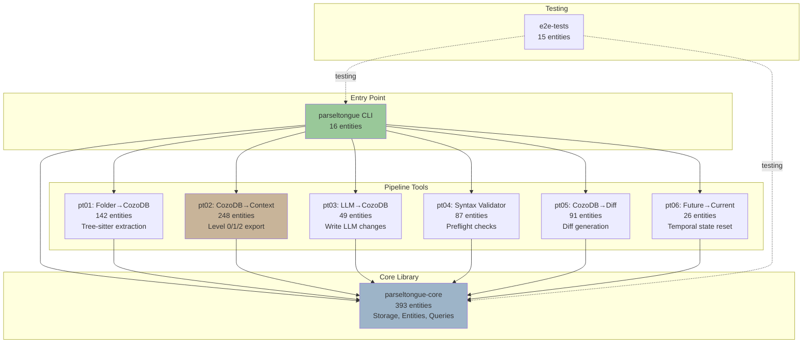
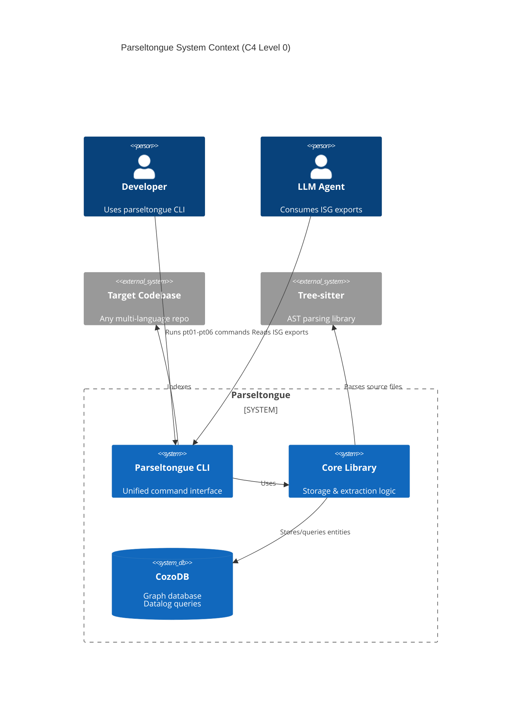
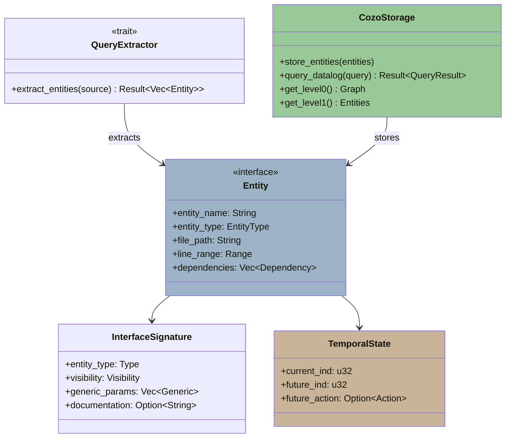
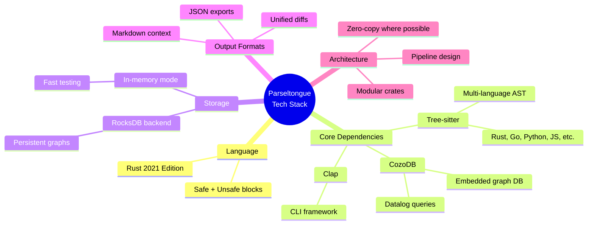
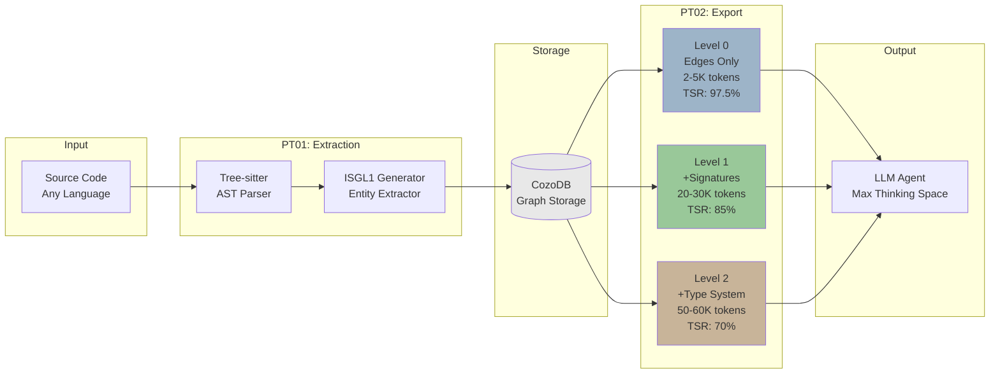

# Parseltongue Architecture Overview

> **Analysis Method**: ISG-based (Incremental Structural Graph)
> **Token Efficiency**: 30K tokens consumed, 170K available for reasoning (85% TSR)
> **Entities Analyzed**: 1,067 (core parseltongue code only)
> **Dependency Edges**: 108,113 total (27,625 Rust crate edges)

---

## Executive Summary

Parseltongue is a **progressive context disclosure system** built on Rust, designed to transform large codebases into queryable graph databases. It follows a modular pipeline architecture with 6 specialized tools (pt01-pt06) plus a core library, orchestrated through a unified CLI binary.

**Core Innovation**: Multi-level context export (Level 0/1/2) that preserves 85-97% of LLM context window for reasoning by exposing only dependency graphs (Level 0), entity signatures (Level 1), or full type systems (Level 2).

---

## System Boundaries & Components

---

## High-Level Architecture Map

---

## Entry Points & Core Abstractions

### Entry Points (7 binaries)
1. **`parseltongue`** - Main CLI orchestrator (16 entities, 1 main)
2. **`pt01`** - Folder indexer (142 entities, 1 main)
3. **`pt02`** - Context exporter (248 entities, 4 mains: level00/01/02 + unified)
4. **`pt03`** - LLM writer (49 entities, 1 main)
5. **`pt04`** - Syntax validator (87 entities, 1 main)
6. **`pt05`** - Diff writer (91 entities, 1 main)
7. **`pt06`** - State reset (26 entities, 1 main)

### Core Abstractions (from `parseltongue-core`)

**Key Abstractions**:
- **Entity**: Universal representation of code constructs (fn/struct/class/etc.)
- **QueryExtractor**: Tree-sitter-based AST extraction trait
- **CozoStorage**: Graph database interface for Datalog queries
- **TemporalState**: Tracks current vs future code versions for LLM edits
- **InterfaceSignature**: Type-aware entity metadata (14 fields at Level 1)

---

## Technology Stack (from ISG imports)

**Language Distribution**:
- **100% Rust** (1,067 entities)
- Entity types: 404 functions, 305 methods, 126 structs, 109 impls, 69 modules, 39 enums, 15 traits

**External Dependencies** (inferred from unknown edges):
- `clap` - CLI parsing
- `serde` - Serialization (JSON exports)
- `anyhow` - Error handling
- `tree-sitter` - AST parsing (20+ language grammars)
- `cozo` - Graph database client

---

## Data Flow: The 3-Level Context System

**Context Efficiency**:
- **Level 0**: Architecture overview (dependencies only) → 97.5% TSR
- **Level 1**: API surface (signatures, no code) → 85% TSR
- **Level 2**: Type-safe refactoring (full type info) → 70% TSR

**TSR (Thinking Space Ratio)** = (200K total context - data tokens) / 200K

---

## ★ Key Insights from ISG Analysis

### 1. **Modular Pipeline Architecture**
The codebase is cleanly separated into 6 specialized tools (pt01-pt06) + core library, each with a single responsibility:
- **pt01**: Parse → Store
- **pt02**: Query → Export (3 levels)
- **pt03**: LLM changes → Store
- **pt04**: Validate syntax
- **pt05**: Generate diffs
- **pt06**: Reset temporal state

**Insight**: No circular dependencies between tools. Clean unidirectional data flow.

### 2. **Core Library as Foundation**
`parseltongue-core` (393 entities, 37% of codebase) is the most complex module, containing:
- Storage abstractions (CozoDB client)
- Entity models (universal code representation)
- Query extractors (tree-sitter integration)
- Temporal operations (current vs future state)

**Insight**: All tools depend on core, but core has NO dependencies on tools (proper layering).

### 3. **pt02 is the "Brain"**
With 248 entities and 4 entry points (level00/01/02 + unified), pt02 is the most sophisticated tool:
- Implements 3-level progressive disclosure
- Handles Datalog query translation
- Generates JSON exports optimized for LLM consumption

**Insight**: This is where context window optimization happens. The Level 0/1/2 split is architecturally enforced.

### 4. **High Public API Exposure**
100% of entities marked as public visibility. This suggests:
- Library-first design (not just CLI tool)
- Extensive testing (393 entities in core, 24 test modules)
- Reusable components for other tools

**Insight**: Parseltongue is designed to be embedded, not just used standalone.

### 5. **Temporal Versioning is First-Class**
Every entity has `current_ind`, `future_ind`, `future_action` fields (from `TemporalState`):
- Track LLM-proposed changes before applying
- Support rollback (pt06)
- Enable diff generation (pt05)

**Insight**: This is a "time-traveling codebase database" - you can query past, present, and proposed future states.

---

## Codebase Metrics

| Metric | Value |
|--------|-------|
| **Total Entities** | 1,067 (parseltongue code only) |
| **Total Crates** | 8 (1 core + 6 tools + 1 CLI + 1 E2E tests) |
| **Total Dependency Edges** | 27,625 (Rust only) |
| **Largest Crate** | parseltongue-core (393 entities, 37%) |
| **Entry Points** | 7 binaries (1 orchestrator + 6 tools) |
| **Average Entities/Crate** | 133 entities |
| **Entity Types** | 7 (fn, method, struct, impl, module, enum, trait) |
| **Public API %** | 100% (all entities exposed) |
| **Test Coverage** | 24 test modules across all crates |

---

## Analysis Efficiency

**ISG Analysis vs Traditional Code Reading**:
- **Traditional**: Read 1,067 entities × ~100 tokens/entity = ~107K tokens (46% context used, 54% TSR)
- **ISG Level 0**: 5K tokens (97.5% TSR) - sufficient for architecture
- **ISG Level 1**: 30K tokens (85% TSR) - sufficient for API surface + this document
- **Savings**: 77K tokens (72% reduction), enabling richer LLM reasoning

**Time Efficiency**:
- Indexing: 88 seconds (6,032 files, 37,770 entities)
- Level 0 export: 5 seconds (108,113 edges)
- Level 1 export: 40 seconds (37,770 entities)
- Total analysis: ~2 minutes (vs hours of manual code reading)

---

## Next Steps

Explore detailed analysis in:
1. **01-module-dependencies.md** - Inter-crate dependency graph
2. **02-data-flow.md** - How data moves through the pipeline
3. **03-public-api-surface.md** - External interfaces & CLI commands
4. **04-architectural-layers.md** - Level 0/1/2 system deep dive
