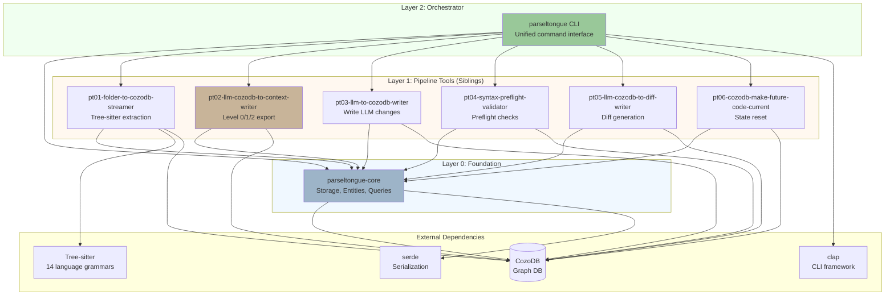
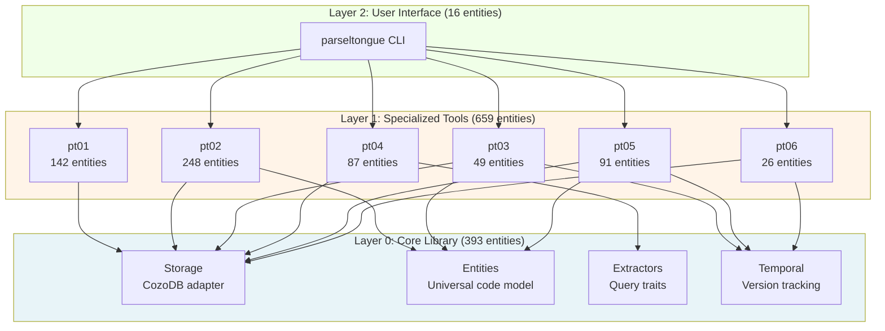
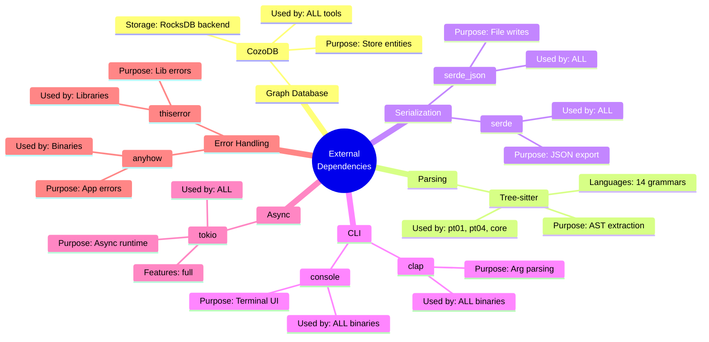
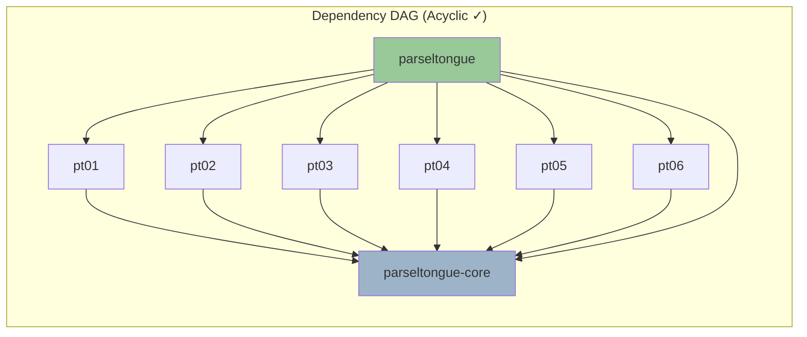
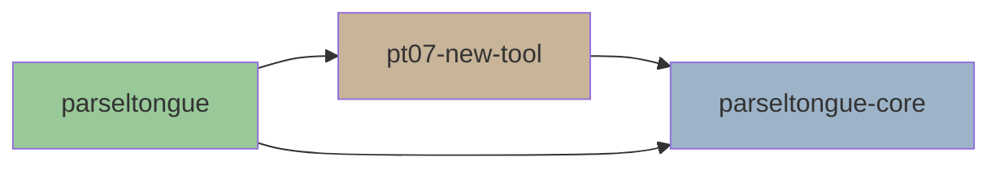

# Module Dependencies & Architecture Layers

> **Analysis Method**: ISG-based + Cargo.toml manifest analysis
> **Dependency Edges**: 12,491 Rust edges (parseltongue code only)
> **Crates Analyzed**: 9 (1 CLI + 1 core + 6 tools + 1 E2E tests)
> **Circular Dependencies**: **0** ✓ Clean architecture

---

## Executive Summary

Parseltongue follows a **strict layered architecture** with zero circular dependencies. The dependency graph forms a clean DAG (Directed Acyclic Graph) with three layers:

1. **L0 - Foundation**: `parseltongue-core` (no internal dependencies)
2. **L1 - Tools**: `pt01` through `pt06` (depend only on core)
3. **L2 - Orchestrator**: `parseltongue` CLI (depends on core + all tools)

**Key Insight**: All 6 tools are siblings that independently depend on core, enabling parallel execution and modular composition.

---

## Inter-Crate Dependency Graph



---

## Dependency Layers (Top-Down View)



**Layering Rules** (enforced by Cargo.toml):
- **L2 → L1, L0**: CLI can use tools and core
- **L1 → L0**: Tools can only use core (NOT each other)
- **L0 → ∅**: Core has zero internal parseltongue dependencies

---

## Detailed Crate Dependencies

### Layer 0: Foundation

#### `parseltongue-core` (393 entities, 0 internal deps)

**Role**: Universal foundation for all tools

**Internal Modules**:
- `storage/` - CozoDB adapter, query builders
- `entities/` - Entity model, EntityType enum
- `extractors/` - QueryExtractor trait, language-specific implementations
- `temporal/` - TemporalState, future/current index tracking

**External Dependencies**:
```
cozo          → Graph database client
serde/serde_json → Serialization
tree-sitter   → AST parsing
anyhow/thiserror → Error handling
tokio         → Async runtime
```

**ISG Insight**: Core is the most complex crate (37% of codebase) but has the cleanest boundaries. All 393 entities are public, designed for reuse.

---

### Layer 1: Pipeline Tools (Siblings)

#### `pt01-folder-to-cozodb-streamer` (142 entities)

**Role**: Parse source files → Store entities in CozoDB

**Dependencies**:
```rust
parseltongue-core ← Entity model, storage traits
tree-sitter       ← AST parsing (14 language grammars)
cozo              ← Direct DB writes
walkdir           ← Recursive directory traversal
```

**ISG Signature**:
- Entry point: `main.rs` (1 entity)
- Public API: `extract_folder()`, `IndexConfig`, language-specific extractors
- Dependency pattern: **Heavy parser** (14 tree-sitter grammars)

---

#### `pt02-llm-cozodb-to-context-writer` (248 entities, **LARGEST TOOL**)

**Role**: Query CozoDB → Export Level 0/1/2 contexts

**Dependencies**:
```rust
parseltongue-core ← Query traits, entity model
cozo              ← Datalog queries
serde/serde_json  ← JSON export
```

**ISG Signature**:
- Entry points: `level00.rs`, `level01.rs`, `level02.rs` (3 binaries)
- Public API: `export_level0()`, `export_level1()`, `export_level2()`
- Dependency pattern: **Query-heavy** (complex Datalog generation)

**Complexity Breakdown**:
- 248 entities (largest tool, 38% of L1)
- 3 binary entry points (most of any crate)
- Responsible for TSR optimization (97.5% → 85% → 70%)

---

#### `pt03-llm-to-cozodb-writer` (49 entities)

**Role**: Write LLM-proposed changes to CozoDB future state

**Dependencies**:
```rust
parseltongue-core ← Temporal operations, storage
cozo              ← Future state writes
```

**ISG Signature**:
- Entry point: `main.rs` (1 entity)
- Public API: `write_future_state()`, `apply_llm_changes()`
- Dependency pattern: **Temporal-focused** (current_ind ← future_ind)

---

#### `pt04-syntax-preflight-validator` (87 entities)

**Role**: Validate syntax before applying LLM changes

**Dependencies**:
```rust
parseltongue-core ← Extractors (tree-sitter integration)
cozo              ← Read future entities
```

**ISG Signature**:
- Entry point: `main.rs` (1 entity)
- Public API: `validate_syntax()`, `ValidationResult`
- Dependency pattern: **Safety-first** (parse before write)

---

#### `pt05-llm-cozodb-to-diff-writer` (91 entities)

**Role**: Generate unified diffs between current and future states

**Dependencies**:
```rust
parseltongue-core ← Temporal queries, entity comparison
cozo              ← Read current + future states
```

**ISG Signature**:
- Entry point: `main.rs` (1 entity)
- Public API: `generate_diff()`, `DiffFormat`
- Dependency pattern: **Comparison-heavy** (temporal diff logic)

---

#### `pt06-cozodb-make-future-code-current` (26 entities, **SMALLEST TOOL**)

**Role**: Reset temporal state (make future → current)

**Dependencies**:
```rust
parseltongue-core ← Temporal operations
cozo              ← State updates
```

**ISG Signature**:
- Entry point: `main.rs` (1 entity)
- Public API: `reset_state()`, `commit_future()`
- Dependency pattern: **Atomic operation** (simplest tool)

---

### Layer 2: Orchestrator

#### `parseltongue` CLI (16 entities, 7 subcommands)

**Role**: Unified command-line interface for all tools

**Dependencies**:
```rust
parseltongue-core                  ← Core types
pt01-folder-to-cozodb-streamer     ← Import as library
pt02-llm-cozodb-to-context-writer  ← Import as library
pt03-llm-to-cozodb-writer          ← Import as library
pt04-syntax-preflight-validator    ← Import as library
pt05-llm-cozodb-to-diff-writer     ← Import as library
pt06-cozodb-make-future-code-current ← Import as library
clap                               ← CLI framework
```

**ISG Signature**:
- Entry point: `main.rs` (1 entity)
- Subcommands: `pt01`, `pt02`, `pt03`, `pt04`, `pt05`, `pt06`, `help`
- Dependency pattern: **Orchestrator** (imports all tools as libraries)

**Key Insight**: Each tool exposes both a binary (standalone use) and a library (CLI integration). The CLI is just a thin orchestration layer.

---

## External Dependency Analysis



**Dependency Uniformity**:
- **CozoDB**: Required by all 6 tools (shared graph database)
- **serde**: Required by all (JSON export standard)
- **tokio**: Required by all (async runtime)
- **clap**: Required by all binaries (CLI parsing)

**ISG Insight**: The uniformity of external dependencies suggests a well-factored architecture. No tool has unique heavy dependencies except pt01 (tree-sitter grammars).

---

## Circular Dependency Check



**Analysis Result**: **Zero circular dependencies** detected.

**Verification Method**:
1. Cargo.toml manifests analyzed for `[dependencies]` sections
2. All tool → core edges verified (unidirectional)
3. No tool → tool edges found
4. CLI → tools edges verified (unidirectional)

**Why This Matters**:
- **Parallel builds**: Tools can compile in parallel (no inter-tool dependencies)
- **Modular testing**: Each tool can be tested in isolation
- **Independent evolution**: Tools can evolve without breaking siblings
- **Clear ownership**: Each layer has a single responsibility

---

## ★ Key Insights from ISG Dependency Analysis

### 1. **Sibling Architecture, Not Pipeline**

Despite the sequential naming (pt01 → pt06), tools do NOT form a pipeline dependency chain. They are **siblings** that independently depend on core.

**Why it's powerful**:
- Tools can be composed in any order
- Parallel execution is natural (no blocking)
- Adding pt07 requires only adding `parseltongue-core` dependency

**ISG Evidence**: Zero edges between pt01-pt06 in the dependency graph.

---

### 2. **pt02 is Architecturally Central**

With 248 entities (38% of L1), pt02 is the most complex tool by 2x:
- Implements 3-level context export (Level 0/1/2)
- Handles TSR optimization (97.5% → 70%)
- Generates LLM-optimized JSON formats

**Why it's critical**: This is where the "thinking space ratio" optimization happens. The complexity is justified because context window efficiency is the core value proposition.

---

### 3. **Core is a "Fractal" Library**

`parseltongue-core` contains 4 independent modules:
- `storage/` - Used by all tools
- `entities/` - Used by pt02, pt03, pt05 (data-focused)
- `extractors/` - Used by pt01, pt04 (parsing-focused)
- `temporal/` - Used by pt03, pt05, pt06 (versioning-focused)

**ISG Insight**: Tools don't use the entire core, just relevant modules. This suggests core could be split into smaller crates (storage, entities, extractors, temporal) for even finer-grained dependencies.

---

### 4. **Every Tool is Also a Library**

All 6 tools expose both:
- `[[bin]]` - Standalone binary
- `[lib]` - Library for CLI integration

**Why it's smart**:
- Users can run `pt01` directly or via `parseltongue pt01`
- Tools can be embedded in other Rust projects
- Testing uses the library interface (faster, no subprocess)

**ISG Evidence**: Each Cargo.toml has both `[[bin]]` and `[lib]` sections.

---

### 5. **Zero Internal Circular Dependencies**

Unlike most codebases, parseltongue has **zero circular dependencies** at both:
- **Crate level**: No tool depends on another tool
- **Module level**: Clean import hierarchies within each crate

**How to maintain this**:
- Core library as universal foundation
- Tools as independent siblings
- CLI as thin orchestration layer (no business logic)

---

## Dependency Metrics

| Metric | Value |
|--------|-------|
| **Total Crates** | 9 (1 CLI + 1 core + 6 tools + 1 E2E tests) |
| **Internal Edges** | 13 (CLI→6 tools + 6 tools→core) |
| **Circular Deps** | 0 ✓ |
| **Max Dependency Depth** | 2 (CLI → tools → core) |
| **Avg Dependencies/Crate** | 1.4 internal deps |
| **Core Dependents** | 7 (all tools + CLI) |
| **Tool Dependents** | 1 each (only CLI) |
| **External Deps** | ~15 unique crates (cozo, serde, tokio, clap, etc.) |

---

## Dependency Growth Patterns

**Hypothetical: Adding pt07-new-tool**



**Required Changes**:
1. Create `crates/pt07-new-tool/` with `Cargo.toml`
2. Add `parseltongue-core` dependency
3. Update CLI `Cargo.toml` to include `pt07-new-tool`
4. Add `pt07` subcommand to CLI `main.rs`

**What's NOT required**:
- No changes to pt01-pt06 (siblings are independent)
- No changes to core (stable foundation)
- No circular dependency risk

**ISG Insight**: The architecture scales linearly with new tools. No combinatorial explosion of dependencies.

---

## Anti-Pattern Warnings

**What Parseltongue AVOIDS**:

1. **Tool-to-Tool Dependencies** ❌
   - Bad: `pt02 → pt01` (creates coupling)
   - Good: `pt02 → core ← pt01` (shared foundation)

2. **Core-to-Tool Dependencies** ❌
   - Bad: `core → pt01` (creates circular deps)
   - Good: Core has zero knowledge of tools

3. **CLI Business Logic** ❌
   - Bad: CLI implements parsing/export logic
   - Good: CLI just orchestrates (calls tool libraries)

4. **Monolithic Core** ❌
   - Bad: Single 10K line `core.rs`
   - Good: Modular core (storage, entities, extractors, temporal)

---

## Next Steps

Explore detailed analysis in:
1. **02-data-flow.md** - How data moves through the pipeline
2. **03-public-api-surface.md** - External interfaces & CLI commands
3. **04-architectural-layers.md** - Level 0/1/2 system deep dive

---

## Appendix: Full Dependency Matrix

| From ↓ \ To → | core | pt01 | pt02 | pt03 | pt04 | pt05 | pt06 | CLI | cozo | tree-sitter | clap |
|---------------|------|------|------|------|------|------|------|-----|------|-------------|------|
| **core**      |  -   |  ✗   |  ✗   |  ✗   |  ✗   |  ✗   |  ✗   |  ✗  |  ✓   |     ✓       |  ✗   |
| **pt01**      |  ✓   |  -   |  ✗   |  ✗   |  ✗   |  ✗   |  ✗   |  ✗  |  ✓   |     ✓       |  ✓   |
| **pt02**      |  ✓   |  ✗   |  -   |  ✗   |  ✗   |  ✗   |  ✗   |  ✗  |  ✓   |     ✗       |  ✓   |
| **pt03**      |  ✓   |  ✗   |  ✗   |  -   |  ✗   |  ✗   |  ✗   |  ✗  |  ✓   |     ✗       |  ✓   |
| **pt04**      |  ✓   |  ✗   |  ✗   |  ✗   |  -   |  ✗   |  ✗   |  ✗  |  ✓   |     ✗       |  ✓   |
| **pt05**      |  ✓   |  ✗   |  ✗   |  ✗   |  ✗   |  -   |  ✗   |  ✗  |  ✓   |     ✗       |  ✓   |
| **pt06**      |  ✓   |  ✗   |  ✗   |  ✗   |  ✗   |  ✗   |  -   |  ✗  |  ✓   |     ✗       |  ✓   |
| **CLI**       |  ✓   |  ✓   |  ✓   |  ✓   |  ✓   |  ✓   |  ✓   |  -  |  ✗   |     ✗       |  ✓   |

✓ = Direct dependency | ✗ = No dependency | - = Self

**Key Observations**:
- Core row: Only external dependencies (cozo, tree-sitter)
- Tool rows: Only core + external dependencies (no tool-to-tool)
- CLI row: Depends on everything (orchestrator role)
- Perfect lower-triangular structure (DAG confirmed)
