# Data Flow & Pipeline Architecture

> **Analysis Method**: ISG-based entity flow tracking
> **Data Stages**: 5 (Parse → Store → Query → Export → Apply)
> **Temporal States**: 2 (current_ind, future_ind)
> **Context Levels**: 3 (Level 0/1/2 with 97.5% → 70% TSR)

---

## Executive Summary

Parseltongue implements a **temporal graph transformation pipeline** where source code flows through 5 stages:

1. **Parse** (pt01): Source files → Entities + Dependencies
2. **Store** (pt01): Entities → CozoDB graph
3. **Query** (pt02): CozoDB → Filtered entity sets
4. **Export** (pt02): Entities → Level 0/1/2 JSON contexts
5. **Apply** (pt03 → pt06): LLM changes → Future state → Current state

**Key Innovation**: Every entity exists in **dual temporal states** (current + future), enabling "time-traveling" code queries and safe LLM-driven refactoring.

---

## End-to-End Data Flow


---

## Data Transformation Stages

### Stage 1: Parse (pt01) - Source → Entities


**Data Transformations**:

**Input**: Raw source files (e.g., `main.rs`)
```rust
pub fn calculate(x: i32) -> i32 {
    x * 2
}
```

**Output**: Entity + Signature (ISGL1 format)
```json
{
  "entity_name": "calculate",
  "entity_type": "fn",
  "file_path": "./src/main.rs",
  "line_range": {"start": 1, "end": 3},
  "interface_signature": {
    "visibility": "Public",
    "generic_params": [],
    "parameters": [{"name": "x", "type": "i32"}],
    "return_type": "i32"
  },
  "current_ind": 1,
  "future_ind": 0,
  "dependencies": []
}
```

**Key Insight**: pt01 discards implementation details (function body) and preserves only:
1. Signature (types, visibility)
2. Location (file, line range)
3. Dependencies (calls, imports)
4. Temporal state (current_ind, future_ind)

**Token Efficiency**: ~100 tokens of source code → ~50 tokens of ISGL1 entity (50% reduction at parse time).

---

### Stage 2: Store (pt01) - Entities → Graph


**CozoDB Schema** (inferred from ISG):

**`entities` relation**:
```cozo
entities[
  isgl1_key: String,           // Primary key (e.g., "rust:fn:calculate:./main.rs:1-3")
  entity_name: String,          // Function/class/etc. name
  entity_type: String,          // "fn", "struct", "class", etc.
  file_path: String,            // Relative path
  line_number: Int,             // Start line
  interface_signature: String,  // JSON blob
  current_ind: Int,             // Temporal: current version
  future_ind: Int,              // Temporal: future version
  forward_deps: Json,           // Dependency array
  reverse_deps: Json            // Reverse dependency array
]
```

**Indexes** (for fast queries):
- `isgl1_key` - Primary key lookup
- `file_path` - Find all entities in a file
- `entity_type` - Filter by type (e.g., "all functions")
- `current_ind` - Find current vs future entities

**Data Volume**:
- 37,770 entities stored
- 108,113 dependency edges stored
- ~500KB total database size (compressed)

---

### Stage 3: Query (pt02) - Graph → Filtered Sets


**Example Datalog Query** (simplified):
```prolog
?[isgl1_key, entity_name, entity_type, file_path, line_number,
  interface_signature, current_ind, future_ind, forward_deps, reverse_deps] :=
  *entities[isgl1_key, entity_name, entity_type, file_path, line_number,
            interface_signature, current_ind, future_ind, forward_deps, reverse_deps],
  file_path ~ '.*src/.*'   # WHERE clause: filter by file path
```

**Query Performance**:
- 37,770 entities → 1,067 filtered entities (97% reduction)
- Query time: ~5 seconds for Level 0 export
- Result size: ~5K tokens (Level 0), ~30K tokens (Level 1)

---

### Stage 4: Export (pt02) - Entities → JSON Contexts

```mermaid
flowchart LR
    subgraph QueryResult["Query Result Set"]
        E1[Entity 1]
        E2[Entity 2]
        E3[Entity N]
    end

    subgraph LevelDecision["Export Level Decision"]
        L0Q{Level 0?<br/>Edges only}
        L1Q{Level 1?<br/>+Signatures}
        L2Q{Level 2?<br/>+Type system}
    end

    subgraph Export["Export Formatters"]
        L0FMT[Level 0 Formatter<br/>from_key → to_key only]
        L1FMT[Level 1 Formatter<br/>+interface_signature]
        L2FMT[Level 2 Formatter<br/>+generics, lifetimes, traits]
    end

    subgraph JSON["JSON Output"]
        L0JSON[Level 0 JSON<br/>5K tokens<br/>TSR: 97.5%]
        L1JSON[Level 1 JSON<br/>30K tokens<br/>TSR: 85%]
        L2JSON[Level 2 JSON<br/>60K tokens<br/>TSR: 70%]
    end

    E1 & E2 & E3 --> L0Q
    L0Q -->|Yes| L0FMT
    L0Q -->|No| L1Q
    L1Q -->|Yes| L1FMT
    L1Q -->|No| L2Q
    L2Q -->|Yes| L2FMT

    L0FMT --> L0JSON
    L1FMT --> L1JSON
    L2FMT --> L2JSON

    style L0JSON fill:#9DB4C8
    style L1JSON fill:#99C899
    style L2JSON fill:#C8B499
```



**Level 0 Export** (Architecture overview):
```json
{
  "export_metadata": {
    "level": 0,
    "total_edges": 27625,
    "timestamp": "2025-11-03T17:25:55Z"
  },
  "edges": [
    {
      "from_key": "rust:fn:calculate:./main.rs:1-3",
      "to_key": "rust:fn:helper:./lib.rs:10-15",
      "edge_type": "Calls"
    }
  ]
}
```

**Level 1 Export** (API surface):
```json
{
  "export_metadata": {
    "level": 1,
    "total_entities": 1067,
    "include_code": false
  },
  "entities": [
    {
      "entity_name": "calculate",
      "entity_type": "fn",
      "file_path": "./main.rs",
      "interface_signature": "{\"visibility\":\"Public\",\"parameters\":[{\"name\":\"x\",\"type\":\"i32\"}],\"return_type\":\"i32\"}",
      "current_ind": 1,
      "future_ind": 0
    }
  ]
}
```

**Level 2 Export** (Type-safe refactoring):
```json
{
  "export_metadata": {
    "level": 2,
    "include_type_system": true
  },
  "entities": [
    {
      "entity_name": "calculate",
      "interface_signature": {
        "visibility": "Public",
        "generic_params": [],
        "lifetimes": [],
        "where_clauses": [],
        "parameters": [{"name": "x", "type": "i32"}],
        "return_type": "i32",
        "trait_bounds": []
      }
    }
  ]
}
```

**Token Consumption by Level**:
| Level | Data Included | Tokens | TSR | Use Case |
|-------|---------------|--------|-----|----------|
| **0** | Edges only | 5K | 97.5% | Architecture questions |
| **1** | +Signatures | 30K | 85% | API surface, this analysis |
| **2** | +Type system | 60K | 70% | Type-safe refactoring |

---

### Stage 5: Apply (pt03 → pt06) - LLM Changes → Current State


**Temporal State Transitions**:

**Initial State** (before LLM changes):
```
Entity: calculate
  current_ind: 1  ← Active version
  future_ind: 0   ← No proposed changes
```

**After pt03** (LLM writes future):
```
Entity: calculate
  current_ind: 1  ← Still active
  future_ind: 2   ← New proposed version
```

**After pt06** (commit future → current):
```
Entity: calculate
  current_ind: 2  ← Future became current
  future_ind: 0   ← Reset
```

**Key Insight**: Temporal versioning enables **safe experimentation**. LLM can propose changes without affecting the current codebase. Validation happens on future state before committing.

---

## Data Flow by Use Case

### Use Case 1: Initial Codebase Indexing


**Performance**:
- Input: 6,032 files
- Output: 37,770 entities + 108,113 edges
- Time: 88 seconds (~68 files/second)
- Database size: ~500KB

---

### Use Case 2: Architecture Exploration (Level 0)


**Performance**:
- Query time: ~5 seconds
- Output size: 5K tokens (edges only)
- LLM context: 195K tokens available for reasoning
- Use case: "How is this codebase structured?"

---

### Use Case 3: API Surface Analysis (Level 1)


**Performance**:
- Query time: ~40 seconds
- Output size: 30K tokens (signatures included)
- LLM context: 170K tokens available
- Use case: "What functions are publicly exported?"

---

### Use Case 4: LLM-Driven Refactoring (Full Pipeline)


**Performance**:
- Level 2 export: ~50 seconds
- LLM planning: Variable (depends on task)
- pt03 write: ~1 second
- pt04 validation: ~2 seconds
- pt05 diff: ~3 seconds
- pt06 commit: ~1 second
- **Total pipeline: ~60 seconds + LLM time**

---

## Data Structures & Formats

### Entity ISGL1 Format (Rust)

```rust
pub struct Entity {
    pub entity_name: String,           // "calculate"
    pub entity_type: EntityType,       // Fn, Struct, Method, etc.
    pub file_path: PathBuf,            // "./src/main.rs"
    pub line_range: Range<usize>,      // 1..3
    pub interface_signature: Signature, // Type info
    pub current_ind: u32,              // Temporal: current version
    pub future_ind: u32,               // Temporal: future version
    pub future_action: Option<Action>, // Add, Modify, Delete
    pub dependencies: Vec<Dependency>, // Forward deps
}
```

### Dependency Edge Format

```rust
pub struct Dependency {
    pub from_key: String,     // "rust:fn:main:./main.rs:1-5"
    pub to_key: String,       // "rust:fn:calculate:./lib.rs:10-15"
    pub edge_type: EdgeType,  // Calls, Imports, Inherits, etc.
}
```

### Signature Format (Level 1)

```rust
pub struct InterfaceSignature {
    pub entity_type: EntityType,      // Fn, Struct, Class, etc.
    pub name: String,                 // "calculate"
    pub visibility: Visibility,       // Public, Private, Internal
    pub file_path: PathBuf,           // "./src/main.rs"
    pub line_range: Range<usize>,     // 1..3
    pub module_path: Vec<String>,     // ["core", "math"]
    pub documentation: Option<String>, // Doc comments
    pub language_specific: LanguageMetadata, // Rust: generics, lifetimes, etc.
}
```

---

## ★ Key Insights from ISG Data Flow Analysis

### 1. **Progressive Context Disclosure**

Parseltongue doesn't dump all data at once. It offers 3 levels:
- **Level 0**: "What's the architecture?" (97.5% TSR)
- **Level 1**: "What's the API surface?" (85% TSR)
- **Level 2**: "How do I refactor safely?" (70% TSR)

**Why it's powerful**: LLMs can start with cheap queries and only pay for expensive queries when needed.

---

### 2. **Temporal Versioning Enables Safe Mutation**

Every entity has dual states (current + future):
- **Current**: Production code
- **Future**: LLM-proposed changes

**Benefits**:
- Validate changes without affecting production
- Generate diffs before committing
- Rollback is trivial (reset future_ind = 0)

---

### 3. **CozoDB as "Smart Cache"**

CozoDB isn't just storage—it's a query accelerator:
- Pre-computed dependency edges (no re-parsing)
- Datalog queries for complex filters
- Indexed lookups for fast retrieval

**Performance**: 37,770 entities indexed in 88 seconds, queried in 5-40 seconds. Compare to: re-parsing 6,032 files every query (~minutes).

---

### 4. **Token Efficiency Compounds**

At each stage, token usage is optimized:
1. **Parse**: 100 tokens → 50 tokens (50% reduction)
2. **Level 0**: 37,770 entities → 5K tokens (99.9% reduction)
3. **Level 1**: 37,770 entities → 30K tokens (99% reduction)

**Result**: 200K token window → 170K tokens for reasoning (85% TSR).

---

### 5. **Pipeline is Composable, Not Sequential**

Despite the naming (pt01 → pt06), the pipeline is **non-linear**:
- pt02 can run multiple times (Level 0, then Level 1, then Level 2)
- pt04 → pt05 → pt06 can be skipped (just explore, don't apply)
- pt01 can re-index incrementally (just changed files)

**Design Principle**: Tools are composable building blocks, not a rigid pipeline.

---

## Data Flow Metrics

| Metric | Value |
|--------|-------|
| **Input Files** | 6,032 files |
| **Entities Extracted** | 37,770 entities |
| **Dependency Edges** | 108,113 edges |
| **Indexing Time** | 88 seconds (~68 files/sec) |
| **Level 0 Export** | 5K tokens (5 seconds) |
| **Level 1 Export** | 30K tokens (40 seconds) |
| **Level 2 Export** | 60K tokens (50 seconds) |
| **Database Size** | ~500KB (compressed) |
| **Token Efficiency** | 85% TSR (Level 1) |

---

## Next Steps

Explore detailed analysis in:
1. **03-public-api-surface.md** - External interfaces & CLI commands
2. **04-architectural-layers.md** - Level 0/1/2 system deep dive

---

## Appendix: Data Flow Cheat Sheet

| Tool | Input | Output | Time | Use Case |
|------|-------|--------|------|----------|
| **pt01** | Source files | CozoDB entities | ~88s | Initial indexing |
| **pt02-level00** | CozoDB | 5K token JSON | ~5s | Architecture questions |
| **pt02-level01** | CozoDB | 30K token JSON | ~40s | API surface analysis |
| **pt02-level02** | CozoDB | 60K token JSON | ~50s | Type-safe refactoring |
| **pt03** | LLM JSON | CozoDB future state | ~1s | Write proposed changes |
| **pt04** | CozoDB future | Validation result | ~2s | Syntax checking |
| **pt05** | CozoDB current+future | Unified diff | ~3s | Review changes |
| **pt06** | CozoDB future | CozoDB current | ~1s | Commit changes |
