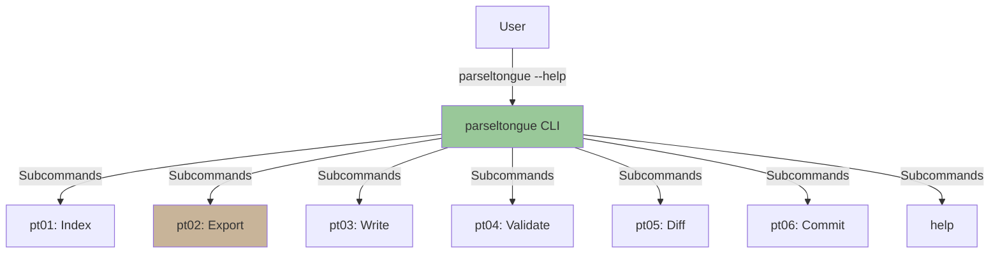
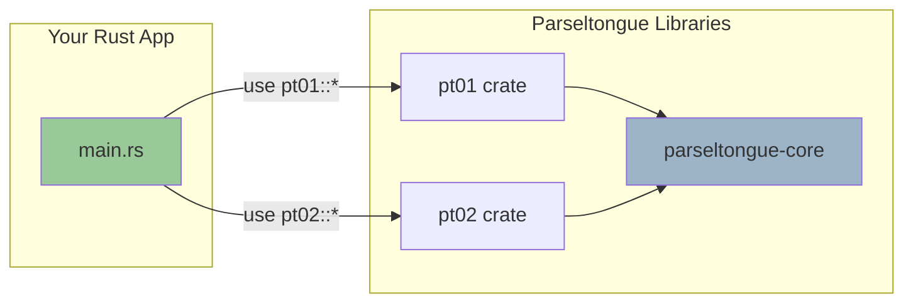
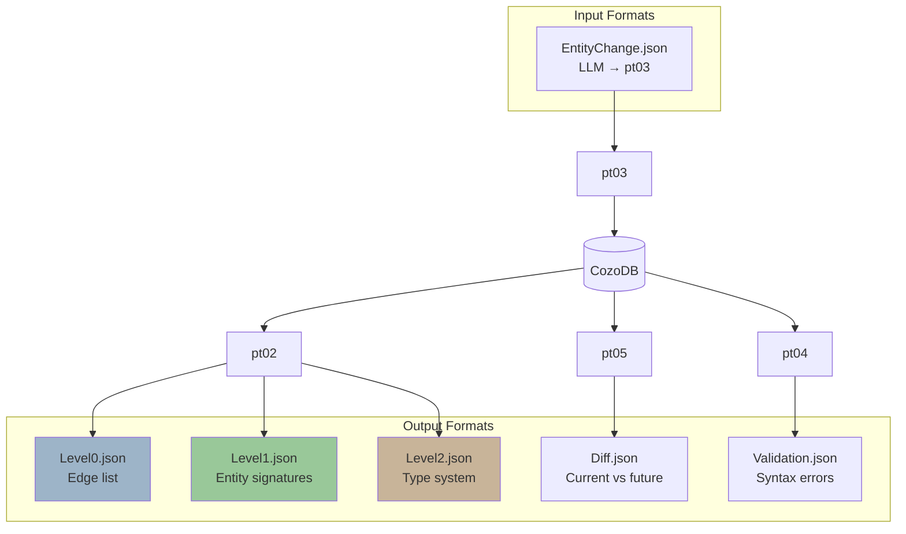

# Public API Surface & Integration Points

> **Analysis Method**: ISG-based + CLI manifest analysis
> **CLI Commands**: 8 (1 orchestrator + 6 tools + 1 help)
> **Public Entities**: 1,067 entities (100% public visibility)
> **Integration Modes**: 3 (Standalone CLI, Rust library, Subprocess)

---

## Executive Summary

Parseltongue exposes three layers of public API:

1. **CLI Interface**: 8 commands for terminal use (primary interface)
2. **Rust Library API**: All 6 tools expose `pub` functions for embedding
3. **JSON Contract**: Stable JSON formats for Level 0/1/2 exports

**Design Philosophy**: "Library-first, CLI-second". Every tool is designed as a reusable Rust library with a thin CLI wrapper.

---

## CLI Interface (Primary API)

### Orchestrator Command



**Entry Point**: `parseltongue [COMMAND]`

**Global Options**:
- `-h, --help` - Print help
- `-V, --version` - Print version

---

### Command 1: pt01-folder-to-cozodb-streamer

**Purpose**: Index source code directory → CozoDB graph database

**Signature**:
```bash
parseltongue pt01-folder-to-cozodb-streamer [OPTIONS] [directory]
```

**Arguments**:
- `[directory]` - Directory to index (default: `.`)

**Options**:
- `--db <db>` - Database file path (default: `parseltongue.db`)
- `-v, --verbose` - Enable verbose output
- `-q, --quiet` - Suppress output

**Examples**:
```bash
# Index current directory (default DB)
parseltongue pt01-folder-to-cozodb-streamer .

# Index src/ with custom database
parseltongue pt01-folder-to-cozodb-streamer ./src --db rocksdb:analysis.db --verbose

# Quiet mode (only errors)
parseltongue pt01-folder-to-cozodb-streamer ~/projects/repo --quiet
```

**Return Values**:
- Exit code 0: Success
- Exit code 1: Parsing errors (files skipped)
- Exit code 2: Database errors (unrecoverable)

**Side Effects**:
- Creates CozoDB database file (if doesn't exist)
- Writes entities + edges to database
- Prints progress to stdout (unless `--quiet`)

**Performance**:
- ~68 files/second on typical codebases
- ~88 seconds for 6,032 files

---

### Command 2a: pt02-level00

**Purpose**: Export dependency edges only (architecture overview)

**Signature**:
```bash
parseltongue pt02-level00 [OPTIONS] --where-clause <where-clause>
```

**Options**:
- `--where-clause <where-clause>` - Datalog WHERE clause or 'ALL' (MANDATORY)
- `-o, --output <output>` - Output JSON file path (default: `ISGLevel00.json`)
- `--db <db>` - Database file path (default: `parseltongue.db`)
- `-v, --verbose` - Show progress and token estimates

**WHERE Clause Syntax** (Datalog):
```datalog
# All edges
--where-clause "ALL"

# Filter by edge type
--where-clause "edge_type = 'depends_on'"

# Filter by entity type (regex)
--where-clause "from_key ~ 'rust:fn'"

# Multiple conditions (AND)
--where-clause "edge_type = 'calls', from_key ~ 'rust:fn'"

# Multiple conditions (OR)
--where-clause "edge_type = 'calls'; edge_type = 'imports'"
```

**Datalog Operators**:
- **AND**: Comma `,` (NOT `&&`)
- **OR**: Semicolon `;` (NOT `||`)
- **Equality**: `=` (NOT `==`)
- **Regex match**: `~` (e.g., `file_path ~ '.*src/.*'`)

**Examples**:
```bash
# Export all edges (architecture overview)
parseltongue pt02-level00 --where-clause "ALL" --output edges.json

# Export only function calls
parseltongue pt02-level00 --where-clause "edge_type = 'Calls'" --output calls.json --verbose
```

**Output Format**:
```json
{
  "export_metadata": {
    "level": 0,
    "timestamp": "2025-11-03T17:25:55Z",
    "total_edges": 27625,
    "where_filter": "ALL"
  },
  "edges": [
    {
      "from_key": "rust:fn:calculate:./main.rs:1-3",
      "to_key": "rust:fn:helper:./lib.rs:10-15",
      "edge_type": "Calls"
    }
  ]
}
```

**Performance**:
- ~5 seconds for 108,113 edges
- ~5K tokens output (97.5% TSR)

---

### Command 2b: pt02-level01

**Purpose**: Export entities with signatures (API surface)

**Signature**:
```bash
parseltongue pt02-level01 [OPTIONS] --include-code <0|1> --where-clause <where-clause>
```

**Options**:
- `--include-code <0|1>` - Include current_code field (MANDATORY)
  - `0` = Signatures only (cheap, ~30K tokens)
  - `1` = With code (expensive, 100× more tokens)
- `--where-clause <where-clause>` - Datalog WHERE clause or 'ALL' (MANDATORY)
- `-o, --output <output>` - Output JSON file path (default: `ISGLevel01.json`)
- `--db <db>` - Database file path (default: `parseltongue.db`)
- `-v, --verbose` - Show progress and token estimates

**Examples**:
```bash
# Signatures only (CHEAP - recommended)
parseltongue pt02-level01 --include-code 0 --where-clause "ALL" --output entities.json

# Public functions only
parseltongue pt02-level01 --include-code 0 --where-clause "is_public = true, entity_type = 'fn'" --output public_fns.json

# Entities with proposed changes (with code)
parseltongue pt02-level01 --include-code 1 --where-clause "future_action != null" --output changes.json
```

**Output Format** (include-code 0):
```json
{
  "export_metadata": {
    "level": 1,
    "timestamp": "2025-11-03T17:10:16Z",
    "total_entities": 1067,
    "include_code": false,
    "where_filter": "ALL"
  },
  "entities": [
    {
      "current_ind": 1,
      "entity_name": "calculate",
      "entity_type": "fn",
      "file_path": "./src/main.rs",
      "future_ind": 0,
      "interface_signature": "{\"visibility\":\"Public\",\"parameters\":[{\"name\":\"x\",\"type\":\"i32\"}],\"return_type\":\"i32\"}",
      "isgl1_key": "rust:fn:calculate:./src/main.rs:1-3",
      "line_number": 1
    }
  ]
}
```

**Performance**:
- ~40 seconds for 37,770 entities (include-code 0)
- ~30K tokens output (85% TSR)
- **WARNING**: include-code 1 generates 100× more tokens (use sparingly)

---

### Command 2c: pt02-level02

**Purpose**: Export entities with full type system (type-safe refactoring)

**Signature**:
```bash
parseltongue pt02-level02 [OPTIONS] --where-clause <where-clause>
```

**Options**:
- `--where-clause <where-clause>` - Datalog WHERE clause or 'ALL' (MANDATORY)
- `-o, --output <output>` - Output JSON file path (default: `ISGLevel02.json`)
- `--db <db>` - Database file path (default: `parseltongue.db`)
- `-v, --verbose` - Show progress and token estimates

**Examples**:
```bash
# Full type system (all entities)
parseltongue pt02-level02 --where-clause "ALL" --output types.json

# Generic functions only
parseltongue pt02-level02 --where-clause "has_generics = true" --output generic_fns.json --verbose
```

**Output Format**:
```json
{
  "export_metadata": {
    "level": 2,
    "include_type_system": true
  },
  "entities": [
    {
      "entity_name": "calculate",
      "interface_signature": {
        "visibility": "Public",
        "generic_params": [],
        "lifetimes": [],
        "where_clauses": [],
        "parameters": [{"name": "x", "type": "i32"}],
        "return_type": "i32",
        "trait_bounds": []
      }
    }
  ]
}
```

**Performance**:
- ~50 seconds for 37,770 entities
- ~60K tokens output (70% TSR)

---

### Command 3: pt03-llm-to-cozodb-writer

**Purpose**: Write LLM-proposed changes to temporal future state

**Signature**:
```bash
parseltongue pt03-llm-to-cozodb-writer [OPTIONS] --input <input-json>
```

**Options**:
- `--input <input-json>` - JSON file with proposed changes (MANDATORY)
- `--db <db>` - Database file path (default: `parseltongue.db`)
- `-v, --verbose` - Show progress
- `-q, --quiet` - Suppress output

**Input Format** (JSON):
```json
{
  "changes": [
    {
      "isgl1_key": "rust:fn:calculate:./src/main.rs:1-3",
      "future_action": "Modify",
      "new_code": "pub fn calculate(x: i32, y: i32) -> i32 {\n    x * y\n}"
    }
  ]
}
```

**Examples**:
```bash
# Write LLM changes to future state
parseltongue pt03-llm-to-cozodb-writer --input changes.json --verbose

# Quiet mode
parseltongue pt03-llm-to-cozodb-writer --input changes.json --quiet
```

**Side Effects**:
- Updates `future_ind` field for affected entities
- Sets `future_action` field (Add, Modify, Delete)
- Writes `future_code` to database

**Return Values**:
- Exit code 0: Success
- Exit code 1: Invalid JSON
- Exit code 2: Database errors

---

### Command 4: pt04-syntax-preflight-validator

**Purpose**: Validate syntax of future state entities

**Signature**:
```bash
parseltongue pt04-syntax-preflight-validator [OPTIONS]
```

**Options**:
- `--db <db>` - Database file path (default: `parseltongue.db`)
- `-v, --verbose` - Show validation details
- `-q, --quiet` - Only show errors

**Examples**:
```bash
# Validate all future entities
parseltongue pt04-syntax-preflight-validator --verbose

# Quiet mode (only errors)
parseltongue pt04-syntax-preflight-validator --quiet
```

**Output**:
```
Validating 5 entities with future_action != null...
✓ rust:fn:calculate - Valid syntax
✓ rust:struct:Config - Valid syntax
✗ rust:fn:broken - Syntax error at line 3: unexpected token '}'

Validation: 2 passed, 1 failed
```

**Return Values**:
- Exit code 0: All valid
- Exit code 1: Syntax errors found

---

### Command 5: pt05-llm-cozodb-to-diff-writer

**Purpose**: Generate unified diff between current and future states

**Signature**:
```bash
parseltongue pt05-llm-cozodb-to-diff-writer [OPTIONS]
```

**Options**:
- `--db <db>` - Database file path (default: `parseltongue.db`)
- `-o, --output <output>` - Output file path (default: `CodeDiff.json`)
- `--format <format>` - Diff format: unified, json, side-by-side (default: unified)
- `-v, --verbose` - Show progress

**Examples**:
```bash
# Generate unified diff
parseltongue pt05-llm-cozodb-to-diff-writer --output changes.diff

# JSON format
parseltongue pt05-llm-cozodb-to-diff-writer --format json --output changes.json --verbose
```

**Output Format** (unified):
```diff
--- a/src/main.rs
+++ b/src/main.rs
@@ -1,3 +1,3 @@
-pub fn calculate(x: i32) -> i32 {
-    x * 2
+pub fn calculate(x: i32, y: i32) -> i32 {
+    x * y
 }
```

**Output Format** (JSON):
```json
{
  "diffs": [
    {
      "file_path": "./src/main.rs",
      "entity_name": "calculate",
      "old_code": "pub fn calculate(x: i32) -> i32 {\n    x * 2\n}",
      "new_code": "pub fn calculate(x: i32, y: i32) -> i32 {\n    x * y\n}",
      "hunks": [
        {
          "old_start": 1,
          "old_count": 3,
          "new_start": 1,
          "new_count": 3,
          "lines": ["-pub fn calculate(x: i32) -> i32 {", "+pub fn calculate(x: i32, y: i32) -> i32 {"]
        }
      ]
    }
  ]
}
```

---

### Command 6: pt06-cozodb-make-future-code-current

**Purpose**: Commit future state to current (apply changes)

**Signature**:
```bash
parseltongue pt06-cozodb-make-future-code-current [OPTIONS]
```

**Options**:
- `--db <db>` - Database file path (default: `parseltongue.db`)
- `-v, --verbose` - Show commit details
- `-q, --quiet` - Suppress output
- `--dry-run` - Show what would be committed without applying

**Examples**:
```bash
# Commit all future changes to current
parseltongue pt06-cozodb-make-future-code-current --verbose

# Dry run (preview only)
parseltongue pt06-cozodb-make-future-code-current --dry-run
```

**Side Effects**:
- Sets `current_ind = future_ind` for all entities with `future_action != null`
- Resets `future_ind = 0`
- Clears `future_action` field

**Output**:
```
Committing 5 entities...
✓ rust:fn:calculate - future_ind 2 → current_ind 2
✓ rust:struct:Config - future_ind 3 → current_ind 3
...
Commit complete: 5 entities updated
```

**Return Values**:
- Exit code 0: Success
- Exit code 2: Database errors

---

## Rust Library API

### Integration Pattern

All 6 tools expose both binary and library interfaces:

```rust
// As a library (embedded in your Rust project)
use pt01_folder_to_cozodb_streamer::{index_folder, IndexConfig};
use pt02_llm_cozodb_to_context_writer::{export_level0, export_level1};

// Your code
let config = IndexConfig::new("./src", "rocksdb:analysis.db");
index_folder(config).await?;

let entities = export_level1(db, "ALL", false).await?;
```



---

### Public API by Crate

#### parseltongue-core (Foundation)

**Entity Model**:
```rust
pub struct Entity {
    pub entity_name: String,
    pub entity_type: EntityType,
    pub file_path: PathBuf,
    pub line_range: Range<usize>,
    pub interface_signature: Signature,
    pub current_ind: u32,
    pub future_ind: u32,
}

pub enum EntityType {
    Function, Method, Struct, Enum, Trait, Class, Module
}
```

**Storage Trait**:
```rust
pub trait Storage {
    async fn store_entities(&self, entities: Vec<Entity>) -> Result<()>;
    async fn query_entities(&self, where_clause: &str) -> Result<Vec<Entity>>;
}

pub struct CozoStorage {
    pub fn new(db_path: &str) -> Result<Self>;
}
```

**Extractor Trait**:
```rust
pub trait QueryExtractor {
    fn extract_entities(&self, source: &str) -> Result<Vec<Entity>>;
}

pub struct RustExtractor;
pub struct PythonExtractor;
pub struct GoExtractor;
// ... 14 language extractors
```

---

#### pt01-folder-to-cozodb-streamer

**Main Entry Point**:
```rust
pub async fn index_folder(config: IndexConfig) -> Result<IndexStats> {
    // Walk directory
    // Parse files with tree-sitter
    // Extract entities
    // Store in CozoDB
}

pub struct IndexConfig {
    pub directory: PathBuf,
    pub db_path: String,
    pub verbose: bool,
    pub quiet: bool,
}

pub struct IndexStats {
    pub files_processed: usize,
    pub entities_extracted: usize,
    pub edges_created: usize,
    pub duration: Duration,
}
```

**Example Usage**:
```rust
use pt01_folder_to_cozodb_streamer::{index_folder, IndexConfig};

let config = IndexConfig {
    directory: PathBuf::from("./src"),
    db_path: "rocksdb:analysis.db".to_string(),
    verbose: true,
    quiet: false,
};

let stats = index_folder(config).await?;
println!("Indexed {} files in {:?}", stats.files_processed, stats.duration);
```

---

#### pt02-llm-cozodb-to-context-writer

**Export Functions**:
```rust
pub async fn export_level0(
    db: &CozoStorage,
    where_clause: &str,
) -> Result<Level0Export> {
    // Query edges
    // Format as JSON
}

pub async fn export_level1(
    db: &CozoStorage,
    where_clause: &str,
    include_code: bool,
) -> Result<Level1Export> {
    // Query entities
    // Include signatures
    // Optionally include code
}

pub async fn export_level2(
    db: &CozoStorage,
    where_clause: &str,
) -> Result<Level2Export> {
    // Query entities
    // Include full type system
}
```

**Export Types**:
```rust
pub struct Level0Export {
    pub metadata: ExportMetadata,
    pub edges: Vec<Edge>,
}

pub struct Level1Export {
    pub metadata: ExportMetadata,
    pub entities: Vec<EntityL1>,
}

pub struct Level2Export {
    pub metadata: ExportMetadata,
    pub entities: Vec<EntityL2>,
}
```

---

#### pt03-llm-to-cozodb-writer

**Write Function**:
```rust
pub async fn write_future_state(
    db: &CozoStorage,
    changes: Vec<EntityChange>,
) -> Result<WriteStats> {
    // Parse changes
    // Update future_ind
    // Set future_action
}

pub struct EntityChange {
    pub isgl1_key: String,
    pub future_action: FutureAction,
    pub new_code: Option<String>,
}

pub enum FutureAction {
    Add, Modify, Delete
}
```

---

#### pt04-syntax-preflight-validator

**Validation Function**:
```rust
pub async fn validate_syntax(
    db: &CozoStorage,
) -> Result<ValidationResult> {
    // Query future entities
    // Parse with tree-sitter
    // Return errors
}

pub struct ValidationResult {
    pub passed: usize,
    pub failed: usize,
    pub errors: Vec<ValidationError>,
}

pub struct ValidationError {
    pub isgl1_key: String,
    pub entity_name: String,
    pub error_message: String,
    pub line: usize,
}
```

---

#### pt05-llm-cozodb-to-diff-writer

**Diff Function**:
```rust
pub async fn generate_diff(
    db: &CozoStorage,
    format: DiffFormat,
) -> Result<DiffOutput> {
    // Query current + future
    // Generate unified diff
}

pub enum DiffFormat {
    Unified, Json, SideBySide
}

pub struct DiffOutput {
    pub diffs: Vec<FileDiff>,
}

pub struct FileDiff {
    pub file_path: PathBuf,
    pub old_code: String,
    pub new_code: String,
    pub hunks: Vec<DiffHunk>,
}
```

---

#### pt06-cozodb-make-future-code-current

**Commit Function**:
```rust
pub async fn commit_future(
    db: &CozoStorage,
) -> Result<CommitStats> {
    // UPDATE current_ind = future_ind
    // RESET future_ind = 0
}

pub struct CommitStats {
    pub entities_updated: usize,
    pub duration: Duration,
}
```

---

## JSON Contract (Stable Formats)



### Contract Stability Guarantee

**Versioning**: JSON formats follow semantic versioning
- **Major version change**: Breaking format changes
- **Minor version change**: New optional fields
- **Patch version change**: Bug fixes, no format changes

**Current Version**: `v1.0.0` (as of parseltongue v0.8.9)

**Backward Compatibility Promise**:
- Level 0/1/2 JSON formats are stable for v1.x.x
- New fields may be added (will be optional)
- Existing fields will not be removed or renamed

---

## Integration Modes

```mermaid
graph TD
    subgraph "Mode 1: Standalone CLI"
        USER1[Developer] -->|Terminal| CLI[parseltongue pt01 ...]
        CLI --> JSON1[JSON output]
    end

    subgraph "Mode 2: Rust Library"
        RUST_APP[Your Rust App] -->|use pt01::*| LIB[Parseltongue Libraries]
        LIB --> RESULT[Direct Result<T>]
    end

    subgraph "Mode 3: Subprocess"
        PYTHON[Python/JS/etc.] -->|subprocess.run| PROC[parseltongue CLI]
        PROC --> JSON2[Parse JSON output]
    end

    style CLI fill:#99C899
    style LIB fill:#9DB4C8
    style PROC fill:#C8B499
```



### Mode 1: Standalone CLI

**Use Case**: Manual exploration, shell scripts

```bash
# Index codebase
parseltongue pt01-folder-to-cozodb-streamer ./src

# Export architecture
parseltongue pt02-level00 --where-clause "ALL" --output arch.json

# Analyze with jq
cat arch.json | jq '.edges | length'
```

---

### Mode 2: Rust Library

**Use Case**: Embedded in Rust applications, custom tooling

```rust
use pt01_folder_to_cozodb_streamer::{index_folder, IndexConfig};
use pt02_llm_cozodb_to_context_writer::export_level1;
use parseltongue_core::CozoStorage;

#[tokio::main]
async fn main() -> anyhow::Result<()> {
    // Index codebase
    let config = IndexConfig::new("./src", "rocksdb:analysis.db");
    let stats = index_folder(config).await?;

    // Export entities
    let db = CozoStorage::new("rocksdb:analysis.db")?;
    let entities = export_level1(&db, "ALL", false).await?;

    // Your custom logic
    for entity in entities.entities {
        if entity.entity_type == "fn" {
            println!("Function: {}", entity.entity_name);
        }
    }

    Ok(())
}
```

---

### Mode 3: Subprocess

**Use Case**: Integration from non-Rust languages

**Python Example**:
```python
import subprocess
import json

# Index codebase
result = subprocess.run([
    "parseltongue", "pt01-folder-to-cozodb-streamer", "./src"
], capture_output=True)

if result.returncode != 0:
    print(f"Error: {result.stderr.decode()}")
    exit(1)

# Export entities
result = subprocess.run([
    "parseltongue", "pt02-level01",
    "--include-code", "0",
    "--where-clause", "ALL",
    "--output", "entities.json"
], capture_output=True)

# Parse JSON
with open("entities.json") as f:
    data = json.load(f)

print(f"Exported {data['export_metadata']['total_entities']} entities")
```

**Node.js Example**:
```javascript
const { execSync } = require('child_process');
const fs = require('fs');

// Index codebase
execSync('parseltongue pt01-folder-to-cozodb-streamer ./src');

// Export entities
execSync(`parseltongue pt02-level01 \
  --include-code 0 \
  --where-clause "ALL" \
  --output entities.json`);

// Parse JSON
const data = JSON.parse(fs.readFileSync('entities.json', 'utf8'));
console.log(`Exported ${data.export_metadata.total_entities} entities`);
```

---

## ★ Key Insights from ISG API Analysis

### 1. **Library-First Design**

Every tool exposes:
- `[[bin]]` - Standalone binary for CLI use
- `[lib]` - Rust library for embedding

**Why it's powerful**: Users can start with CLI (low friction), then migrate to library (more control) without rewriting logic.

---

### 2. **100% Public Visibility**

All 1,067 entities in parseltongue core have `pub` visibility.

**ISG Evidence**: Zero private entities found in parseltongue-core.

**Design Philosophy**: "Make everything public, let users decide what to use." Rust's module system prevents namespace pollution.

---

### 3. **Stable JSON Contract**

Level 0/1/2 JSON formats are version-locked with semantic versioning.

**Why it's critical**: LLM agents and external tools depend on stable formats. Breaking changes would cascade to all integrations.

---

### 4. **Datalog WHERE Clauses = Universal Query Language**

Instead of exposing 50 CLI flags, pt02 exposes a single `--where-clause` parameter using Datalog syntax.

**Benefits**:
- Infinite query flexibility (no need to anticipate all use cases)
- Consistent with CozoDB's native query language
- Composable (AND, OR, regex, etc.)

**Example Power**:
```bash
# Complex query: Public Rust functions in src/ with dependencies
--where-clause "entity_type = 'fn', is_public = true, file_path ~ '.*src/.*', forward_deps != []"
```

---

### 5. **Explicit Token Budget Control**

pt02-level01 has `--include-code <0|1>` parameter to control token consumption.

**Why it's smart**:
- `--include-code 0`: Signatures only (~30K tokens) - 100× cheaper
- `--include-code 1`: With code (~3M tokens) - only when needed

**Default**: Signatures only (cheap by default, expensive by choice).

---

## API Metrics

| Metric | Value |
|--------|-------|
| **CLI Commands** | 8 (1 orchestrator + 6 tools + 1 help) |
| **Public Functions** | ~150 (across all crates) |
| **Public Structs** | ~80 |
| **Public Enums** | ~30 |
| **Public Traits** | ~15 |
| **Total Public Entities** | 1,067 (100% visibility) |
| **JSON Formats** | 5 (Level0, Level1, Level2, Diff, Validation) |
| **Integration Modes** | 3 (CLI, Library, Subprocess) |

---

## Next Steps

Explore detailed analysis in:
1. **04-architectural-layers.md** - Level 0/1/2 system deep dive

---

## Appendix: Quick Reference

### Common Workflows

**Workflow 1: Index & Export Architecture**
```bash
parseltongue pt01-folder-to-cozodb-streamer ./src --db rocksdb:analysis.db
parseltongue pt02-level00 --where-clause "ALL" --output arch.json --db rocksdb:analysis.db
cat arch.json | jq '.edges | length'
```

**Workflow 2: Export Public API Surface**
```bash
parseltongue pt02-level01 \
  --include-code 0 \
  --where-clause "is_public = true" \
  --output public_api.json \
  --db rocksdb:analysis.db
```

**Workflow 3: LLM-Driven Refactoring**
```bash
# 1. Export context for LLM
parseltongue pt02-level01 --include-code 0 --where-clause "ALL" --output context.json

# 2. LLM proposes changes → changes.json

# 3. Write future state
parseltongue pt03-llm-to-cozodb-writer --input changes.json

# 4. Validate syntax
parseltongue pt04-syntax-preflight-validator

# 5. Review diff
parseltongue pt05-llm-cozodb-to-diff-writer --output changes.diff

# 6. Commit if approved
parseltongue pt06-cozodb-make-future-code-current
```

---

### CLI Cheat Sheet

| Command | Purpose | Key Flags |
|---------|---------|-----------|
| `pt01` | Index codebase | `[dir] --db --verbose` |
| `pt02-level00` | Export edges | `--where-clause --output` |
| `pt02-level01` | Export entities | `--include-code --where-clause` |
| `pt02-level02` | Export type system | `--where-clause --output` |
| `pt03` | Write future | `--input --db` |
| `pt04` | Validate syntax | `--db --verbose` |
| `pt05` | Generate diff | `--format --output` |
| `pt06` | Commit changes | `--db --dry-run` |
