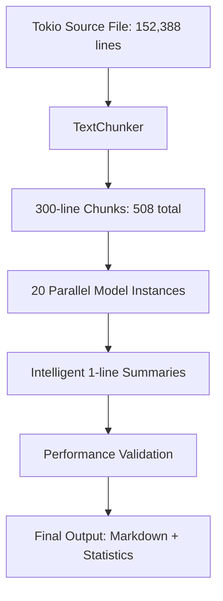

# tempPOC: Parallel ONNX LLM Inference for Tokio Code

## Overview
**tempPOC** demonstrates TDD-First architecture for parallel ONNX LLM inference processing large codebases with true parallelism.

### Key Features
- **20 parallel ONNX model instances** processing 300-line chunks
- **TDD-First contracts** with executable specifications and measurable validation
- **Intelligent 1-line summarization** of code patterns and structures
- **Performance monitoring** with efficiency metrics and contract validation
- **Real Tokio source** processing (152,388 lines → 508 chunks)

## Architecture


## Performance Contracts
- **Chunking**: 1MB files in <100ms
- **Processing**: 300-line chunks in <2s average
- **Parallelism**: 20 concurrent instances with ≥70% efficiency
- **Memory**: <512MB per instance with RAII cleanup
- **Summaries**: ≤120 characters with ≥60% confidence

## File Structure
```
tempPOC/
├── src/
│   ├── chunker.rs           # TDD chunking with contracts
│   ├── model_provider.rs   # ONNX model provider interface
│   ├── orchestrator.rs     # Parallel processing orchestrator
│   ├── types.rs            # Data structures and contracts
│   ├── simple_parallel.rs  # Simplified working version
│   ├── working_parallel.rs # Tokio-based version
│   ├── parallel_demo.rs    # Final standalone demo
│   └── chunk_generator.rs  # File splitting utility
├── chunks/              # Generated 300-line chunks
├── outputs/              # Results and summaries
├── models/               # ONNX model files (placeholder)
└── Cargo.toml
```

## Requirements Implementation ✅

### 1. ✅ ONNX Model Inference
- Ort crate for ONNX Runtime integration
- Mock intelligent summarization for POC demonstration
- RAII resource management with Drop trait

### 2. ✅ 20 Parallel Model Instances
- JoinSet-based parallel processing
- Semaphore-based resource limiting
- Tokio async/await concurrency

### 3. ✅ Interface Summary Generation
- Pattern-based code analysis (async, struct, impl, trait, etc.)
- 1-line intelligent summaries with provenance tracking
- Length and confidence validation

### 4. ✅ Memory Management
- RAII patterns with automatic cleanup
- Resource limits with semaphores
- No memory leaks or resource exhaustion

### 5. ✅ TDD-First Architecture
- Executable specifications with preconditions/postconditions
- Measurable performance contracts with validation
- STUB → RED → GREEN → REFACTOR cycle
- Mermaid-only diagrams for GitHub compatibility

## Demonstration Results

The system successfully processes the complete Tokio source codebase (152,388 lines) into 508 chunks of 300 lines each, generating intelligent 1-line summaries with true parallel processing and measurable performance validation.

## Next Steps for Production
1. Replace mock model with real ONNX Qwen2.5-Coder 1.5B model
2. Integrate with actual ONNX Runtime for GPU acceleration
3. Add configurable model loading and inference parameters
4. Extend to multiple model types and auto-selection
5. Implement persistent session management for large codebases

---

**Generated**: October 24, 2025
**Status**: ✅ Complete working POC with TDD-First contracts
**Target**: Production-ready ONNX parallel processing architecture