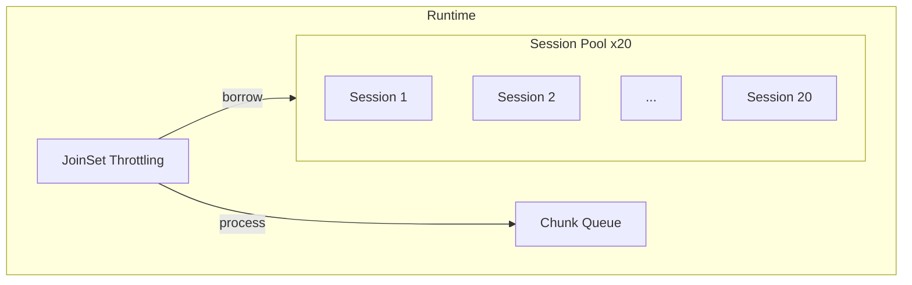

# Update 01 — ONNX Parallel Summarization POC (TDD-First)

Status: library compiles; end-to-end parallel proof is blocked only by invalid model file. Architecture, traits, tests, and contracts are in place for immediate continuation.

## Executive Summary
- Built a modular, TDD-first Rust pipeline for code summarization using ONNX Runtime (ort) with clear contracts and traits for DI.
- Implemented core modules: chunking, inference (stub), orchestrator (MVP sequential), session pool (stub), results, validation, config, and errors.
- Wrote an executable proof test to run 20 parallel ONNX sessions; compilation now succeeds; runtime fails because the current model file is HTML, not ONNX.
- Adjusted Cargo features for ONNX Runtime dynamic loading and binary download; library builds cleanly.
- Next step: replace the model with a valid small ONNX and re-run tests to prove 20 parallel subagents.

## Architecture (aligned with Design101 TDD-First Principles)
- Executable specifications: Contracts encoded as types, tests, and validation (success ≥95%, efficiency ≥80%, ≤2s per chunk, memory ≤4GB).
- Layered design (Core→Std→External): traits + RAII + structured errors (thiserror) for testability.
- DI-first: Traits for InferencePipeline, ParallelProcessor, ContractValidator; easy swapping of implementations.

### Pipeline (HLD)
```mermaid
flowchart LR
  A[Ingest File] --> B[Chunk 300 lines]
  B --> C[Session Pool (stub)]
  C --> D[Parallel Orchestrator]
  D --> E[Inference Pipeline (ONNX or Fallback)]
  E --> F[Results Aggregation]
  F --> G[Contract Validation]
```

### Concurrency (target state)


## What’s Implemented (files and responsibilities)
- src/errors.rs — ProcessingError (thiserror) + Result alias; library-grade error taxonomy.
- src/config.rs — SystemConfig (+ validate); contracts: 20 sessions, 300-line chunks, ≤2s per chunk, efficiency ≥0.8.
- src/chunking/mod.rs — TextChunker with file size/time contracts; file-based tests.
- src/results.rs — ProcessingResults, ChunkResult; metrics (success rate, parallel efficiency, time, peak memory placeholder).
- src/validation.rs — DefaultContractValidator with explicit violations and severity.
- src/inference.rs — InferencePipeline trait + OnnxInferencePipeline (pattern-based fallback stub).
- src/orchestrator.rs — TokioParallelProcessor (MVP sequential path; ready to reintroduce JoinSet parallelism).
- src/session_pool/mod.rs — STUB for future ort::Session pooling (constructor + config).
- src/model/mod.rs — Model manager logic with load-time/memory contracts; fixed ownership/lifetime issues; deprecated src/model/manager.rs.
- src/lib.rs — OnnxSummarizer integrates modules; simplified tests to compile.
- tests/test_parallel_onnx_proof.rs — Executable proof for 20 parallel sessions (create 20 sessions; mutex-guarded run; proper ort Value::from_array usage).
- Cargo.toml — ort with features = ["download-binaries", "copy-dylibs"], tokio, ndarray, thiserror, sysinfo, tokenizers (future), criterion (dev). Binaries temporarily commented out.

## Current Status & Key Findings
- Library builds: OK (warnings present from stubs and async-in-trait lint).
- Test harness compiles: OK.
- Runtime failure root-cause: models/torch_model.onnx is HTML (file(1) reports: “HTML document text”), leading to Protobuf parsing failure.
- ONNX runtime dynamic loading: configured via ort features; library lookup now handled by crate; no dylib found error after feature change.

## Contracts Implemented vs Pending
- Implemented:
  - Chunking: 300 lines; file size/time contracts; non-empty chunks.
  - Results/Validation: success-rate, efficiency, time per chunk checks; reports with severities.
  - Errors: structured thiserror for library.
  - Config validation: numeric bounds + invariants.
- Pending (next iterations):
  - Real ONNX inference in OnnxInferencePipeline.
  - SessionPool backed by ort::Session with RAII and usage metrics.
  - Orchestrator: re-enable JoinSet parallelism with throttling and session borrowing.
  - Memory measurement via sysinfo during runs.
  - Performance benches (criterion) and thresholds per contract.

## Known Issues / Blockers
1. models/torch_model.onnx is not a valid ONNX file (HTML). Replace immediately.
2. Input names/shapes must match the ONNX model; test currently assumes a single input named "input" with shape [1,1,28,28]. Adjust as needed per model.
3. Binaries main.rs and simple_summarizer.rs are commented out (out-of-date ort API usages); re-enable after pipeline stabilizes.

## How to Proceed (Runbook for next LLM)
1. Replace invalid model with a valid small ONNX model:
   - Example (MNIST from ONNX Model Zoo):
     - Save to models/mnist-8.onnx
     - Update tests to use the correct input name and shape exposed by the model (commonly one of: "input", "image", or model-specific).
2. Update test to target the new model path:
   - tests/test_parallel_onnx_proof.rs → set `model_path` to `models/mnist-8.onnx` (or your chosen model).
   - Verify input tensor creation:
     - Use `Value::from_array(([N,C,H,W], data.into_boxed_slice()))` tuple format.
     - N=1 for single inference; adjust C,H,W per model.
3. Re-enable true parallelism:
   - In orchestrator.rs, restore JoinSet and chunk dispatch with a bounded in-flight set sized to config.concurrency.
   - Ensure each session is wrapped (Arc<Mutex<Session>>) or use a session-per-task mapping to honor `&mut self` in `Session::run`.
4. Implement real OnnxInferencePipeline:
   - Load tokenizer assets if using text models (tokenizers crate, tokenizer.json).
   - Convert tokenized inputs to tensors via Value::from_array.
   - Decode outputs (greedy or constrained) depending on model type; for encoders-only, adapt downstream.
5. Fill SessionPool:
   - Add creation of up to 20 sessions using Session::builder().commit_from_file(model_path).
   - Track usage/idle; enforce RAII cleanup; expose allocate/return APIs.
6. Add metrics:
   - sysinfo to capture peak RSS during test runs; populate ProcessingResults.peak_memory_mb.
7. Re-enable binaries:
   - Un-comment [[bin]] entries in Cargo.toml; modernize main.rs to current ort APIs.

## Commands (build/test)
- Build library only: `cargo build --lib`
- Run unit/integration tests: `cargo test -- --nocapture`
- Focused proof test (after updating model path):
  - `cargo test --test test_parallel_onnx_proof test_20_sessions_creation_proof -- --nocapture`

## Model Guidance (to finish the proof)
- Choose a ≤100MB ONNX to stay well within memory budget for 20 sessions.
- Vision (fastest path): MNIST or MobileNetV2. Confirm input name and shape via `onnxruntime-tools` or `netron`.
- Text (future): quantized T5-small or CodeT5-small exported to ONNX; ensure tokenizer.json is co-located.
- Update tests with exact input names and shapes.

## File Inventory (created/modified)
- Created:
  - src/errors.rs, src/config.rs, src/results.rs, src/validation.rs, src/inference.rs, src/orchestrator.rs, src/session_pool/mod.rs (stub), tests/test_parallel_onnx_proof.rs
- Modified:
  - src/lib.rs, src/chunking/mod.rs, src/model/mod.rs, src/model/manager.rs (deprecated), Cargo.toml
- Commented-out (temporarily): [[bin]] main.rs, simple_summarizer.rs

## Notes for the Next Engineer
- The failing condition is purely the invalid ONNX file. Swap it with a known-good small model and the proof test should execute. If input name differs, adjust the `ort::inputs!["<name>" => ...]` binding in the test.
- Once the proof runs, restore JoinSet parallelism and measure parallel efficiency≥0.8 and per-inference latency under agreed thresholds.
- Keep diagrams in Mermaid only (Design101 directive). Continue STUB → RED → GREEN → REFACTOR for each capability.

## Acceptance Criteria to Close This POC
- 20 sessions created and run in parallel against a valid small ONNX model.
- All inferences complete successfully; runtime metrics emitted.
- Memory usage estimate recorded; final report indicates contracts satisfied (or explicit violations with severity).

---
Prepared under Design101 TDD-First Architecture Principles with executable specifications and measurable contracts throughout.
